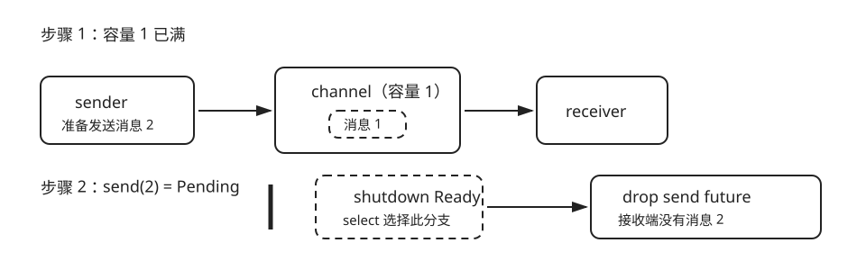

# Channel、取消与背压

| 任务 | 概念 | 预计时间 | 项目产物 |
|---|---|---:|---|
| 让异步任务能暂停、排队和停止 | Tokio task、mpsc、Pending、backpressure、cancellation safety | 120 分钟 | 有边界的任务流水线 |

Tokio 的有界 channel 把容量写进系统：队列满时，第二个 `send().await` 会进入 `Pending` 并让出执行权，这就是背压（backpressure）。shutdown 分支先完成时，仍未完成的 send future 被丢弃，第二条消息不会偷偷进入队列。



本地练习和图使用同一个案例：容量为 1，先放入消息 1，再轮询消息 2 的发送 future。

```rust,ignore
let (sender, mut receiver) = tokio::sync::mpsc::channel(1);
sender.send(1).await?;
let mut blocked_send = Box::pin(sender.send(2));

let shutdown = async {};
let cancelled = tokio::select! {
    biased;
    () = shutdown => true,
    result = &mut blocked_send => {
        result?;
        false
    }
};
drop(blocked_send);
assert!(cancelled);
assert_eq!(receiver.recv().await, Some(1));
assert!(receiver.try_recv().is_err());
```

练习额外用 `poll_fn` 手动轮询一次第二个 send：必须看到 `Poll::Pending`，才说明验证的是背压而不是碰巧先选 shutdown。

```sh
cd exercises
rustlings run 16_backpressure_cancel
```

## 取消安全检查表

逐个检查 `.await`：在它之前是否已经写了半份状态？未选中的 branch 被 drop 后是否能安全重试？同步锁是否跨暂停点持有？网络读取通常可以取消；“先扣款再写记录”的两步副作用则需要事务或重新建模。

项目中的并发窗口限制在途目标数，总超时取消超预算的请求/退避，Web 的 Ctrl-C 信号停止接收新连接。三处机制不同，但都依赖“future 可以在暂停点被丢弃”的同一语义。
