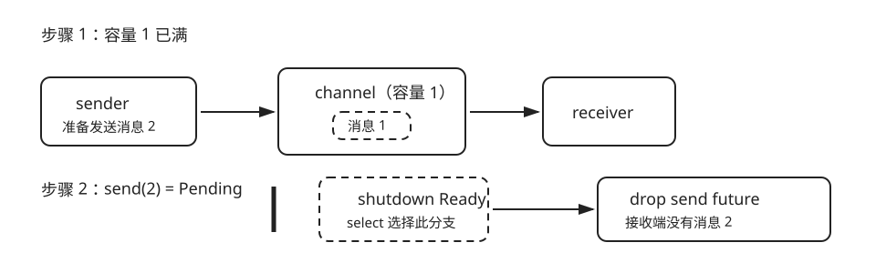

# Channel、取消与背压

| 任务 | 概念 | 预计时间 | 项目产物 |
|---|---|---:|---|
| 让异步任务能暂停、排队和停止 | Tokio task、mpsc、Pending、backpressure、cancellation safety | 2.5 小时 | 有边界的任务流水线 |

> **预计 2.5 小时**。上一章讲了「future 可以在 `.await` 处被丢弃」，这一章讲它的两个直接后果：**排队时谁来承担压力**，以及**被丢弃时世界处于什么状态**。
>
> 本章的异步例子需要 Tokio，所以它们标着 `ignore`——但**每一段输出都是真实运行得到的**，不是示意。

---

## 1. 从共享状态走到消息传递

上一章结尾给了三种并发形状的提问顺序。这一章展开第二种：**把「状态变化」变成消息**。

对比一下同一个需求的两种写法：

| | `Arc<Mutex<Vec<T>>>` | `mpsc::channel` |
|---|---|---|
| 数据在哪 | 一份，大家共享 | 随消息移动，每次只有一方持有 |
| 同步手段 | 加锁 | 队列本身 |
| 队列无限增长时 | 内存涨（没人拦你） | **有界时自动产生背压** |
| 死锁可能 | 有（多把锁时） | 没有 |
| 适合 | 多个读者要看到同一份最新值 | 生产者/消费者、事件流、流水线 |

第二行和第三行是重点：**channel 把「排队」这件事变成了类型和容量参数**，而共享状态下的排队是隐式的——它表现为锁竞争，或者干脆表现为内存增长到 OOM。

---

## 2. 有界 channel：容量是设计参数，不是性能调优

```rust,ignore
let (sender, receiver) = tokio::sync::mpsc::channel(1);   // 容量 = 1
```

那个 `1` 不是随便填的。**它决定了系统的背压点在哪里。** 看看容量为 1 时会发生什么：

```rust,ignore
use tokio::sync::mpsc;

#[tokio::main]
async fn main() {
    let (sender, mut receiver) = mpsc::channel(1);

    sender.send(1).await.expect("第一条应该能进队列");

    // 第二次 send 会进入 Pending：没有容量了
    let mut blocked = Box::pin(sender.send(2));
    let waker = std::task::Waker::noop();
    let mut context = std::task::Context::from_waker(waker);
    match blocked.as_mut().poll(&mut context) {
        std::task::Poll::Pending => println!("Pending"),
        std::task::Poll::Ready(result) => println!("Ready: {result:?}"),
    }

    // 取走一条，容量释放
    receiver.recv().await;

    // 再试一次：现在能进去了
    println!("{:?}", blocked.as_mut().poll(&mut context));
}
```

真实输出：

```text
消息 1 已入队
消息 2 的 send 处于 Pending（背压生效）
收到 Some(1)
消息 2 再次尝试 = Ready(Ok(()))
收到 Some(2)
```

**`Pending` 就是背压。** 发送方没有被阻塞、没有自旋、没有失败——它让出了执行权，运行时去跑别的任务。等到接收方腾出容量，发送方被唤醒，继续。

这就把「生产者比消费者快」这件必然发生的事，变成了一个**有位置、有名字、可观察**的状态，而不是内存慢慢涨上去。



### 容量怎么选

| 容量 | 含义 | 什么时候用 |
|---|---|---|
| `1` | 严格串行，最强背压 | 生产者和消费者必须同步推进；教学与测试 |
| 较小固定值（8、64） | 吸收抖动，但不囤积 | 大多数流水线 |
| `unbounded_channel` | **没有背压** | 只有在你确信消费速度永远跟得上时；否则它就是内存泄漏的另一种写法 |
| `oneshot` | 一对一、只发一次 | 请求-响应（返回结果给等待者） |
| `watch` | 只保留最新值 | 配置热更新、状态广播 |
| `broadcast` | 每个订阅者都收到 | 事件通知 |

**`unbounded` 不是「更快的 `bounded`」，它是「取消背压」。** 用之前先回答：如果消费者停了一小时，这一小时的消息去哪？

---

## 3. `select!` 与取消：被丢弃的是 future

`select!` 的语义可以一句话说完：**同时等待多个 future，第一个完成的胜出，其余的立刻被丢弃。**

```rust,ignore
let cancelled = tokio::select! {
    biased;                              // 按书写顺序检查，而不是随机
    () = shutdown => true,               // 分支一：收到关闭信号
    result = &mut blocked_send => {      // 分支二：发送终于成功
        result?;
        false
    }
};
```

真实运行结果：

```text
shutdown 之前，send 的状态 = true      ← 先确认它真的在等容量
被取消 = true
队列里仍然只有: Some(1)                ← 第二条消息没有偷偷进去
再取一次（应为空）: true
```

第一行是这段代码里最重要的设计：**先手动 poll 一次，确认 `Pending` 之后再让 `select!` 竞争。** 否则「shutdown 赢了」可能只是因为 `send` 碰巧还没被轮询到——那样测试验证的是巧合，不是背压。

```rust,ignore
// 先确认背压真实存在，再验证取消
// （这一段就是上面代码里 shutdown 之前的部分）
let observed = blocked_send.as_mut().poll(&mut context);
assert!(matches!(observed, Poll::Pending));
```

### 取消之后，世界是什么状态？

这是本章真正的主题。`select!` 丢弃了 `blocked_send`，于是：

- 第二条消息**没有**进入队列（真实输出第三行证明了这一点）；
- 发送端的容量没有被消耗；
- 没有半条消息、没有脏状态。

**`send` 恰好是取消安全的操作**：它要么完成，要么什么都没做。但不是所有操作都这样——这就是下一节的内容。
---

## 4. 取消安全检查表

**定义**：一个操作是「取消安全」的，当且仅当**在它的任意 `.await` 处丢弃它，都不会丢数据、也不会留下不一致状态**。

逐个 `.await` 问三个问题：

1. 在这行之前，是否已经写了**半份状态**？
2. 这个分支没被选中、future 被丢弃后，**能安全重试**吗？
3. 有没有**同步锁跨越了这个暂停点**？

按这三问分类常见操作：

| 操作 | 取消安全 | 为什么 |
|---|---|---|
| `recv().await` | ✅ | 要么收到消息，要么没动过 |
| `send().await` | ✅ | 要么消息入队，要么没入队（前面已用真实输出证明） |
| `sleep`、`timeout` | ✅ | 只是不再等待 |
| `read_exact` | ❌ | 读到一半被取消，已读字节丢失且无法知道读了多少 |
| `write_all` | ❌ | 同上，写了一半 |
| 先扣款、再写记录 | ❌ | 两步副作用，重试会重复第一步 |

前三个是「原子操作」：它们要么完整发生，要么完全没发生。后三个是「有进度的操作」：内部状态在 `.await` 之间发生了变化，而**变化本身没有被记在返回值里**。

### 反例：读到一半被取消

```rust,ignore
// 危险：read_exact 不是取消安全的
let mut header = [0_u8; 8];
tokio::select! {
    _ = timeout(Duration::from_secs(1), reader.read_exact(&mut header)) => {
        // 超时了：header 里可能是半份数据，甚至第一份数据已经读掉
    }
    _ = shutdown => {}
}
```

如果超时后你打算**重试**这次读取，就会丢掉已经读进 `header` 的字节——协议流从此错位。安全的写法是用能表达「已读部分」的类型（自己维护缓冲区），或者干脆把读取放进独立任务，用 `oneshot` 把结果传回来。

### 反例：同步锁跨越暂停点

```rust,ignore
let guard = std::sync::Mutex::new(vec![1]).lock().unwrap();
some_io().await;         // 编译失败：MutexGuard 不是 Send
drop(guard);
```

这个在编译期就被挡住了（上一章讲过）。但**运行期的版本更隐蔽**：用 `tokio::sync::Mutex` 就编译通过了，可是你在等 I/O 的时候仍然占着锁，别的任务只能排队——从「死锁」变成了「性能塌方」。

### 项目里怎么做到的

`projects/monitor-core` 的重试循环里只有三类 `.await`：`client.get(..).send()`、`tokio::time::sleep`、以及总超时的包裹。它们全是原子操作，所以：

- 超时把整个检查丢掉 → 没有半份结果被记录（`CheckResult` 只在最后构造一次）；
- 重试发生时，前一次请求的 future 已经被丢弃，连接由 `Client` 的连接池回收；
- 没有任何锁跨越暂停点。

**这不是巧合，是设计约束**：把「有进度的操作」挡在检查器之外，取消安全问题就不会出现。

---

## 5. 同一个语义，三处应用

| 位置 | 取消谁 | 机制 |
|---|---|---|
| 单次检查的总超时 | 整个检查（含重试与退避） | `tokio::time::timeout` 丢弃内部 future |
| 批量并发窗口 | 尚未开始的目标 | `buffered` 只推进窗口内的 future |
| Web 服务的 Ctrl-C | 停止接收新连接，等已在处理的请求收尾 | `with_graceful_shutdown` |

三处的机制完全不同，但都建立在同一句话上：**future 可以在暂停点被安全丢弃。**

注意第三处与前两处的区别：前两处是「主动放弃工作」，第三处是「优雅收尾」——它不丢弃正在处理的请求，只停止接受新的。**取消不总是意味着丢弃**，有时候意味着「不再开始新的」。

---

## 6. 深水区

### 6.1 channel 的关闭是一等语义

```rust,ignore
// 所有发送端被丢弃后：
receiver.recv().await          // -> None，循环自然结束
sender.send(value).await       // -> Err(SendError(value))，值被还给你
```

注意 `SendError` **把值还回来了**：这不是设计上的客气，而是所有权规则的自然结果——发送失败时，值的所有权没有被转移走。

`tokio::sync::mpsc` 没有单独的 `close()` 调用：**「还有没有发送端」就是关闭信号**。这和上一章 `drop(sender)` 的规则是同一条。

### 6.2 `try_recv` 与 `try_send`：不要用它们做流程控制

| 方法 | 行为 | 用途 |
|---|---|---|
| `recv().await` | 等到有消息或关闭 | 正常消费 |
| `try_recv()` | 立刻返回，可能 `Empty` | 事件循环里的「顺手清空」、测试 |
| `send().await` | 等到有容量或关闭 | 正常生产 |
| `try_send()` | 满就返回 `Full` | 明确要「满了就丢」的场景（指标上报） |

把 `try_recv` 放在循环里轮询，等于手写忙等——**`Pending` 存在的意义就是让你不用这么做。**

### 6.3 请求-响应用 `oneshot`，不要复用 `mpsc`

```rust,ignore
let (reply_sender, reply_receiver) = tokio::sync::oneshot::channel();
worker_sender.send(Job { payload, reply: reply_sender }).await?;
let result = reply_receiver.await?;      // 只等这一个任务的回复
```

用 `mpsc` 做请求-响应会引入「怎么把回复和请求对上」的问题（需要 id、需要路由表）。`oneshot` 用所有权解决了它：**回复通道随请求一起被移动过去，只可能被用一次。**

### 6.4 `select!` 的循环写法

真实的任务循环通常长这样：

```rust,ignore
loop {
    tokio::select! {
        biased;
        () = &mut shutdown => break,                 // 关停优先
        Some(message) = receiver.recv() => {          // 有消息就处理
            handle(message).await;
        }
        else => break,                                // 所有分支都不可能时退出
    }
}
```

`&mut shutdown` 这种写法让同一个 future 在多次循环之间**保持存活**——每轮重新创建一个 future 会丢掉它已经注册的唤醒状态。这是一条容易忽略但很关键的细节。
---

## 7. 常见误解

| 误解 | 准确说法 |
|---|---|
| 「channel 比锁快，所以都用 channel」 | 两者解决不同问题。channel 的代价是数据搬家和队列管理，收益是不用共享可变状态。 |
| 「`unbounded_channel` 只是没有容量上限」 | 它是**取消了背压**：消费者变慢时，内存就是队列。 |
| 「`select!` 会并行跑所有分支」 | 它在同一个任务里同时*等待*，只有一个分支会完成，其余 future 被丢弃。 |
| 「取消会回滚已做的事」 | 不会。取消只是不再推进；是否留下半成品取决于操作本身。 |
| 「`try_recv` 比 `recv` 快」 | 在循环里轮询 `try_recv` 是手写忙等；`recv` 才是让出执行权的正确方式。 |
| 「channel 关闭需要显式 close」 | `mpsc` 用「所有发送端被丢弃」表达关闭，`recv` 返回 `None`。 |

---

## 8. 练习与自测

### 练习

```sh
cd exercises
rustlings run 16_backpressure_cancel
```

练习会额外用 `poll_fn` 手动轮询一次第二个 `send`：**必须看到 `Poll::Pending`**，才说明验证的是背压，而不是碰巧先选到了 shutdown。这和本章第 3 节开头做的是同一件事。

做完之后再跑一次项目的并发测试，观察背压与并发窗口如何配合：

```sh
cargo test -p monitor-core --test concurrency -- --nocapture
cargo test -p monitor-core --test retry
```

### 自测清单（能全部做到才算掌握）

1. 解释有界 channel 的容量参数为什么是**设计决策**，而不是性能调优。
2. 用一句话说明背压是什么，并说出它在代码里的可见信号。
3. 说出 `select!` 的完整语义（包括没被选中的分支会怎样）。
4. 解释为什么例子要「先 poll 一次确认 Pending」再让 `select!` 竞争。
5. 给出取消安全的定义，并判断 `recv`、`send`、`read_exact` 是否安全。
6. 说出「先扣款再写记录」为什么不能靠重试补救，以及两种可行的改法。
7. 解释 `mpsc` 的关闭语义，以及 `SendError` 为什么把值还回来。
8. 说出「取消」与「优雅关闭」的区别，并各举一个项目里的例子。

---

## AI 辅导提示词

这三段可以直接复制给 AI 助手（Kimi、ChatGPT 等）。它们的设计意图是**让助手出题和追问，而不是替你写代码**——完整方法论见[用 AI 助手当教练](../guided/ai-tutor.md)。

```text
下面是我的任务循环（含 select!）。请逐个检查每个 .await 处的取消安全性：
如果在那一行被丢弃，已经发生的副作用是什么？重试会重复什么？
只给分析，不要改代码。

[粘贴循环]
```

```text
我在为一条流水线选 channel 的容量。请先问我三个问题
（生产速度与消费速度的量级、消费者停顿时的可接受延迟、消息丢一条的后果），
然后给出建议和理由。不要直接给代码。
```

```text
请出 3 道关于取消的判断题，考察：
哪些操作取消安全、select! 丢弃分支的后果、以及「取消」与「优雅关闭」的区别。
先只出题，我答完后逐条点评，重点指出我理由里的错误。
```
