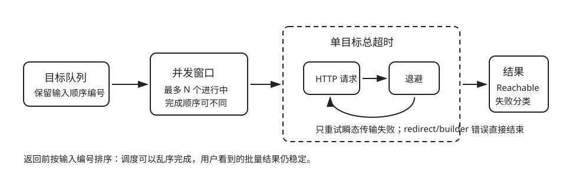

# 受控并发、超时、重试与分类

| 任务 | 概念 | 预计时间 | 项目产物 |
|---|---|---:|---|
| 安全检查一批网站 | bounded concurrency、timeout、retry、backoff | 180 分钟 | 显式检查调度层 |

调度顺序固定为：

1. 从输入序列取目标。
2. 最多同时推进 `concurrency` 个检查。
3. 整个目标检查共享一个总超时，覆盖请求、重试与退避。
4. 只对传输类失败做有限重试。
5. 重试前执行明确的 backoff。
6. 最终结果按输入顺序返回，并带稳定错误分类。



对应的三个测试各自只验证一个行为：

```sh
cargo test -p monitor-core --test retry
cargo test -p monitor-core --test timeout
cargo test -p monitor-core --test concurrency
```

超时测试使用 Tokio 虚拟时间；并发测试用信号量控制本地服务器放行，不依赖 `sleep` 猜测时序。总超时放在重试循环外层，因此两次失败请求和中间退避不能把一次检查无限拉长。

## 故意改坏再修复

1. 把 `buffer_unordered` 的并发数改成目标总数，运行并发测试，解释为什么“更快”不是无上限的理由。
2. 把 `timeout` 移进重试循环，观察总耗时语义如何改变，再恢复测试要求的总期限。
3. 删除结果排序，构造先后完成顺序相反的两个目标，确认为什么输出顺序会漂移。

这三项连同测试阅读预计再用 2–3 小时；完成标准是能画出“并发窗口、总期限、重试循环”三层边界，而不是记住某个组合子名字。
