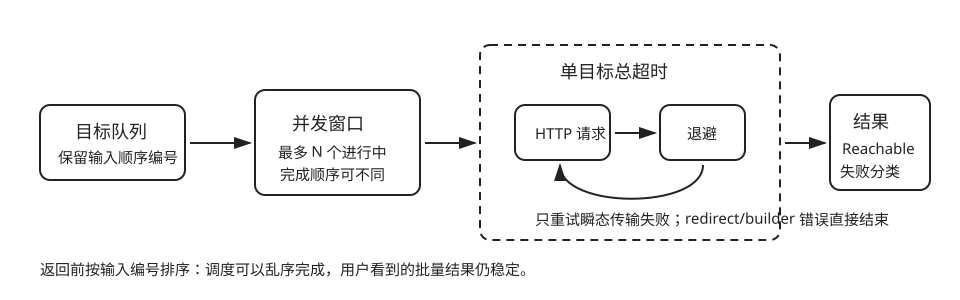

# 受控并发、超时、重试与分类

| 任务 | 概念 | 预计时间 | 项目产物 |
|---|---|---:|---|
| 安全检查一批网站 | bounded concurrency、timeout、retry、backoff | 3 小时 | 显式检查调度层 |

> **预计 3 小时**。这是核心阶段的收束：把「检查一个站点」扩展成「**安全地**检查一批站点」。难点不在并发本身，而在三个边界的相互作用——并发窗口、总期限、重试循环。

---

## 1. 先把边界画出来，再写代码

调度顺序是固定的，而且**每一层都有明确的职责**：

```text
1. 从输入序列取目标
2. 最多同时推进 concurrency 个检查     ← 并发窗口：控制压力
3. 整个目标检查共享一个总超时            ← 总期限：控制最坏耗时
4. 只对传输类失败做有限重试              ← 重试：只救值得救的
5. 重试前执行明确的 backoff              ← 退避：给对端喘息
6. 最终结果按输入顺序返回                ← 顺序：协议的一部分
```



**为什么顺序重要？** 因为这五个决定互相影响：

| 如果搞错 | 表现 |
|---|---|
| 并发窗口放在总期限之内（每个目标各自计时） | 一批 100 个慢站点会跑几个小时 |
| 总期限放在重试循环之内 | 重试永远没机会发生，或者总耗时变成「次数 × 期限」 |
| 重试一切失败 | 确定性错误被重复三遍，延迟变三倍 |
| 不保序 | 下游拿到顺序漂移的报告，无法和输入对齐 |

---

## 2. 并发窗口：为什么不是「全部一起发」

项目的实现只用了一个组合子：

```rust,ignore
pub async fn check_all(&self, targets: &[MonitorTarget]) -> Vec<CheckResult> {
    stream::iter(targets.iter().cloned())
        .map(|target| {
            // 每个检查拥有自己的目标和自己的 checker 句柄；
            // 这样每个 future 都不借用调用方，可以 spawn 到运行时上。
            let checker = self.clone();
            async move { checker.check(&target).await }
        })
        .buffered(self.policy.concurrency().get())
        .collect()
        .await
}
```

`buffered(n)` 一句话概括：**最多同时推进 n 个 future，结果按输入顺序产出。**

（函数文档里还有一层原因：闭包为什么要把 `checker` 和 `target` 都变成自己的。不这么做的话，每个 future 都会借用 `self` 和切片，编译器会因为高阶生命周期问题拒绝把它交给 `tokio::spawn`——这个问题在写代码时表现为 `implementation of FnOnce is not general enough`。）

### 为什么必须有上限

```text
不设上限的三种后果：
1. 本机端口/文件描述符耗尽（一批 1000 个目标 = 1000 个并发连接）
2. 对端把你当攻击者（很多站点会限流甚至封禁）
3. 超时判定失去意义（大家都在抢资源，每个都变慢）
```

**「更快」不是无上限的理由。** 并发数是容量参数，和 channel 的容量、连接池大小是一类东西：它表达「我最多愿意同时给对方多大压力」。

### 上限怎么定

| 场景 | 起点 | 调整依据 |
|---|---|---|
| 检查少量自有服务 | 8–16 | 观察总耗时与对端错误率 |
| 检查第三方站点 | 2–4 | 礼貌优先；错误码 429 变多就调低 |
| 本机压测 | 与 CPU 核数相关 | 用测量而不是猜 |

---

## 3. 超时：一层不够

项目测试里有一条断言，它把整个设计意图写成了可执行的规格：

```rust,ignore
#[tokio::test(start_paused = true)]
async fn the_total_deadline_covers_retry_backoff() {
    // 没有服务在监听，而每次重试都想等 10 秒。
    // 2 秒的总期限必须赢，否则一批死掉的主机会花掉「次数 × 退避」的时间。
    ...
    let started = Instant::now();
    let result = checker.check(&target).await;

    assert_eq!(started.elapsed(), Duration::from_secs(2));
    assert!(matches!(result.outcome(), CheckOutcome::Unreachable { kind: CheckFailureKind::Timeout, .. }));
}
```

两个关键点：

1. **总期限在重试循环之外。** 三次尝试、每次 10 秒退避，最终仍然只花 2 秒——因为外层 `tokio::time::timeout` 把整个内部 future 丢掉了。
2. **`start_paused = true` 让虚拟时间精确可控。** 断言 `elapsed == 2s` 而不是 `elapsed < 3s`，所以这个测试在繁忙的 CI 上不会随机失败。

**这就是「不依赖真实等待」的写法**：不是把等待调短，而是让时间变成可以精确断言的东西。

---

## 4. 重试：只救值得救的

```rust,ignore
/// 传输层错误里哪些值得重试。
fn is_retryable_transport_error(error: &reqwest::Error) -> bool {
    error.is_timeout()
        || error.is_connect()
        || error.is_body()
        // "request" 类里排掉三种确定性失败
        || (error.is_request() && !error.is_builder() && !error.is_redirect() && !error.is_decode())
}
```

那三个排除项是这段代码的灵魂：

| 排除的 | 为什么不能重试 |
|---|---|
| `is_builder()` | 请求构造就有问题（比如非法头），重试还是同一个错误 |
| `is_redirect()` | 重定向次数超限，重试只会再走一遍同样的循环 |
| `is_decode()` | 响应内容和预期格式不符，是确定性的 |

**判据只有一条：重试这个失败，结果会不会不一样？** 不会不一样的失败，重试就是把延迟乘以次数。

### 状态码也要参与重试判断

```rust,ignore
/// 状态码里哪些值得再试一次。
fn is_retryable_status(status: StatusCode) -> bool {
    matches!(status.as_u16(), 408 | 429) || status.is_server_error()
}
```

- `408 Request Timeout`、`429 Too Many Requests`：服务器**明确邀请**你稍后再来；
- `5xx`：服务器坏了，而不是请求错了；
- 其余状态码（含 4xx）：那是一个**答案**，再问一遍不会变。

注意与领域结果的配合：**重试 5xx 是调度层的决定，不影响「响应就是可达」这条领域规则。** 试完仍然失败时，结果照旧是 `Reachable { status: 500 }`——因为服务器确实回答了。
---

## 5. 退避：固定、指数、抖动

退避不是一个 `Duration`，而是一套策略。项目把它建模成值对象：

```rust,ignore
pub struct Backoff {
    initial: Duration,
    multiplier: u32,
    max: Duration,
    jitter: Jitter,
}

impl Backoff {
    pub const fn none() -> Self;                       // 不等待（测试用）
    pub const fn fixed(delay: Duration) -> Self;       // 每次都等这么久
    pub const fn exponential(initial: Duration) -> Self; // 倍增，默认上限 30 秒，带全抖动

    /// 第 retry_index 次重试前应该等多久（1 起算），不含随机。
    pub fn base_delay(&self, retry_index: u32) -> Duration;

    /// 真正要睡的时长：把随机数当参数传进来，而不是藏在函数里。
    pub fn delay(&self, retry_index: u32, jitter_fraction: f64) -> Duration;
}
```

| 策略 | 第 1/2/3 次重试的等待 | 什么时候用 |
|---|---|---|
| `none()` | 0 / 0 / 0 | 测试；确定不会失败的场景 |
| `fixed(100ms)` | 100 / 100 / 100 ms | 已知故障是瞬时的、恢复很快 |
| `exponential(100ms)` | 100 / 200 / 400 ms | 默认选择；对端可能过载 |

### 抖动不是装饰

如果一千个客户端同时对同一个服务重试，固定退避会让他们**始终同步**：同一秒重试、同一秒再失败、同一秒再重试——你的重试逻辑变成了对故障服务的周期性冲击（惊群）。

抖动把等待时间打散：`Jitter::Full` 从 `0..=计算值` 里均匀取一个数。

关键在于**可测性**：

```rust,ignore
// 随机数是参数，不是隐藏状态 —— 于是这条规则可以脱离时钟被测试
#[test]
fn the_server_hint_wins_over_the_computed_backoff_but_is_capped() {
    let computed = Duration::from_millis(50);
    assert_eq!(retry_wait(computed, None), computed);
    assert_eq!(retry_wait(computed, Some(Duration::from_secs(2))), Duration::from_secs(2));
    assert_eq!(retry_wait(computed, Some(Duration::from_secs(600))), MAX_RETRY_AFTER);
}
```

设计上的教训值得单独记一句：**把随机性当参数传进来，纯逻辑就能测试。** 反过来，函数内部直接读系统时间或随机数，你就只能写「大概是这样」的测试。

### 尊重服务器说的 Retry-After

```rust,ignore
fn retry_wait(computed: Duration, retry_after: Option<Duration>) -> Duration {
    retry_after.map_or(computed, |hint| hint.min(MAX_RETRY_AFTER))
}
```

`429` 或 `503` 响应常带 `Retry-After` 头。**服务器明确告诉你等多久时，用它，而不是用你猜的退避值**——它知道自己的恢复窗口，你不知道。上限仍然要设（防止对端让你等一小时）。

---

## 6. 保序：为什么是 `buffered` 而不是「先乱序再排序」

早期实现用 `buffer_unordered` 跑完之后按索引排序。现在的实现用 `buffered` 直接保序。两者的差别值得说清楚：

| | `buffer_unordered(n)` + 排序 | `buffered(n)` |
|---|---|---|
| 并发度 | n | n |
| 结果顺序 | 需要额外排序 + 索引 | **天然按输入顺序** |
| 内存 | 需要额外保存索引 | 无需 |
| 适用 | 顺序无所谓，谁先完成谁先用 | 输出要与人读的输入对齐 |

**为什么顺序是协议的一部分？** 因为使用者拿到的报告要能和输入一一对应：

```text
输入：[api, web, db]
输出：[api 的结果, web 的结果, db 的结果]      ← 期望
输出：[web 的结果, api 的结果, db 的结果]      ← 使用者必须自己配对
```

当输出是给人看的表格、或者要写进按行对齐的报告时，顺序漂移会让整个工具变得不可信。这不是「顺便排一下」的问题，而是**接口承诺**——所以它有专门的测试：

```rust,ignore
#[tokio::test(start_paused = true)]
async fn batch_results_keep_input_order_when_responses_finish_out_of_order() {
    // 第一个目标慢 10 秒，第二个立刻返回
    let results = checker.check_all(&targets).await;
    let names = results.iter().map(CheckResult::target_name).collect::<Vec<_>>();
    assert_eq!(names, vec!["slow-first", "fast-second"]);
}
```

---

## 7. 深水区

### 7.1 最坏耗时是可以算出来的

给定策略，一批目标的最坏耗时有一个上界：

```text
最坏总耗时 ≈ (目标数 ÷ 并发数) × 单个目标的总期限
```

这个公式解释了为什么三个参数必须一起看：**并发数调小一半，最坏耗时翻倍**；总期限翻倍，最坏耗时也翻倍。运维关心的是这个上界，而不是平均值。

### 7.2 并发窗口本身就是背压

上一章讲过 channel 容量是背压点。批量检查里，**并发窗口是同一个东西的另一种形态**：目标列表是「生产者」，执行器是「消费者」，窗口大小决定了积压能在哪里形成。

区别在于：channel 的背压会**阻塞发送方**，而并发窗口的背压只是**让后面的目标等着**——因为输入已经全在内存里了（来自一个 JSON 文件）。如果输入本身是流式的（例如从标准输入逐行读），那就该换成 channel + 有界队列。

### 7.3 怎么证明「更快」

迁移到并发之后，「更快了」必须是可以被观察的：

```sh
# 顺序版本：注意总耗时
time monitor-sync batch targets.json

# 并发版本
time monitor batch targets.json --concurrency 8
```

但**不要用真实公网站点做这个对比**——网络抖动会让结论不可复现。正确做法是本地起若干个可控延迟的服务器，比较同一批目标在两种实现下的耗时。这也是项目测试里 `serve_after(delay)` 的用途。

---

## 8. 常见误解

| 误解 | 准确说法 |
|---|---|
| 「并发数越大越快」 | 受对端、本机资源与超时判定限制；超过某个点只会让失败变多。 |
| 「超时设一次就够了」 | 单次请求超时和整个检查的总期限是两层；缺一层语义就错。 |
| 「重试次数越多越可靠」 | 只对**不确定**的失败有用；确定性失败重试只是把延迟乘以次数。 |
| 「退避就是为了让代码看起来专业」 | 它是给对端恢复窗口，抖动是防止客户端同步重试形成惊群。 |
| 「顺序可以最后再排」 | 顺序是对外协议的一部分；用 `buffered` 天然保序比事后排序更省。 |
| 「虚拟时间的测试不算真实测试」 | 它精确验证语义（例如总期限恰好 2 秒）；真实时间只验证「差不多」。 |

---

## 9. 练习与自测

### 故意改坏再修复

三项实验各改一处，跑测试，解释现象，再改回来：

1. **把 `buffered` 的并发数改成目标总数**，运行并发测试，解释为什么「更快」不是无上限的理由。
2. **把 `timeout` 移进重试循环**，观察总耗时语义如何改变，再恢复测试要求的总期限。
3. **删掉保序**（换成 `buffer_unordered` 不加排序），构造先后完成顺序相反的两个目标，确认为什么输出顺序会漂移。

```sh
cargo test -p monitor-core --test retry
cargo test -p monitor-core --test timeout
cargo test -p monitor-core --test concurrency
```

完成标准：**能画出「并发窗口、总期限、重试循环」三层边界**，而不是记住某个组合子的名字。

### 自测清单（能全部做到才算掌握）

1. 画出三层边界的嵌套关系，并说明每一层各自控制什么。
2. 解释为什么总期限必须在重试循环之外，用「次数 × 退避」说明后果。
3. 说出三种不该重试的传输错误，以及判断「值得重试」的唯一标准。
4. 说明抖动的必要性，以及把随机数作为参数带来的好处。
5. 解释 `Retry-After` 为什么优先于计算出的退避值，以及为什么还要设上限。
6. 说出 `buffered` 与 `buffer_unordered` 的区别，以及本项目为什么选前者。
7. 用公式估算一批目标的最坏耗时，并说明三个参数如何互相影响。
8. 说明为什么「用公网站点比较顺序与并发版本」是无效的测量。

---

## AI 辅导提示词

这三段可以直接复制给 AI 助手（Kimi、ChatGPT 等）。它们的设计意图是**让助手出题和追问，而不是替你写代码**——完整方法论见[用 AI 助手当教练](../guided/ai-tutor.md)。

```text
下面是我的批量检查配置（并发数、总超时、重试次数、退避）。
请先帮我算出最坏耗时上界，再回答：
1. 哪个参数最该先调？
2. 如果对端开始返回 429，我的策略会怎么表现？
只给分析，不要改代码。

[粘贴策略参数与目标数量]
```

```text
请出 3 道判断题，考察重试与超时的边界：
给定一种失败（超时、连接被拒、重定向过多、500、404），
让我判断该不该重试、最终应记录成 Reachable 还是 Unreachable、退出码是几。
我答完后逐条点评。
```

```text
我想证明并发版本确实比顺序版本快，但不想依赖真实网站。
请先问我三个问题（延迟如何注入、如何保证可复现、要比较哪个指标），
再给出实验设计。不要直接给代码。
```
