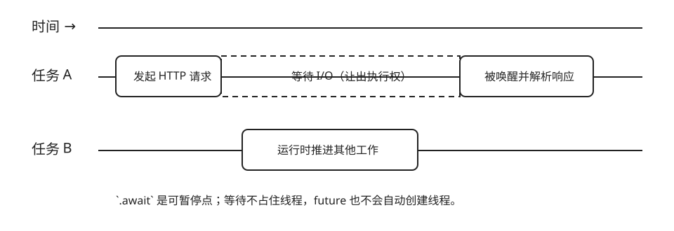

# Future、任务与运行时

| 任务 | 概念 | 预计时间 | 项目产物 |
|---|---|---:|---|
| 理解 `.await` 前后谁在推进工作 | future、task、runtime、取消 | 120 分钟 | 可解释的异步心智模型 |

`async fn` 调用后先产生一个 future；只有 runtime 轮询（poll）它，工作才会前进。`.await` 表示“当前任务暂时让出执行权，等依赖的 future 可继续时再回来”，不是创建线程。



```rust,ignore
async fn check(url: &str) -> Result<u16, reqwest::Error> {
    let response = reqwest::get(url).await?;
    Ok(response.status().as_u16())
}
```

先预测：删除 `.await` 后得到的是状态码，还是一个尚未完成的值？把 future 创建出来却从不 `.await`，网络请求是否一定发生？

## 取消的直觉

当持有 future 的任务被丢弃，future 也会被丢弃。异步函数必须在每个 `.await` 处都能安全暂停；不要跨 `.await` 长时间持有同步锁，也不要假设下一行一定执行。

项目用 Tokio 统一 runtime。先运行一个测试，再用 `--nocapture` 观察并发案例：

```sh
cargo test -p monitor-core --test concurrency -- --nocapture
```
