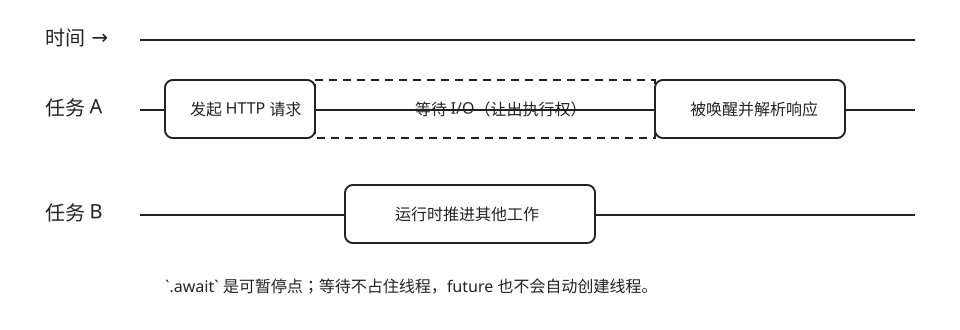

# Future、任务与运行时

| 任务 | 概念 | 预计时间 | 项目产物 |
|---|---|---:|---|
| 理解 `.await` 前后谁在推进工作 | future、task、runtime、取消 | 3 小时 | 可解释的异步心智模型 |

> **预计 3 小时**。这一章是全书的语义核心：把「`.await` 前后到底谁在干活」这件事彻底想清楚，之后所有异步代码都只是它的应用。
>
> 本章的例子**只用标准库**——不引入 Tokio，因为运行时正是要讲清楚的东西，不该先把它当黑盒用掉。

---

## 1. 一个反直觉的起点：创建 future 什么都不会发生

```rust,editable
fn main() {
    let future = async {
        println!("future 的内部代码执行了");
        42
    };

    println!("future 已经创建，但什么都没发生");
    drop(future);
    println!("丢弃之后也没有发生");
}
```

先跑一遍。输出里**永远不会**出现「内部代码执行了」——因为 `async` 块创建的是一个**值**，不是一次调用。同理，`async fn` 被调用时也只是构造了一个值：

```rust,editable
async fn fetch(name: &str) -> String {
    println!("开始 {name}");
    format!("{name} 的结果")
}

fn main() {
    let pending = fetch("A");
    println!("已创建 A 的 future");
    drop(pending);
}
```

这和普通函数完全不同：`fn fetch()` 一调用就跑到返回。`async fn` 的调用只是**准备了一次计算**。

> 这一条推翻了很多人对异步的第一印象（「`async` 就是开个后台任务」）。它更接近「构造了一个可以分步推进的状态机」。

---

## 2. Future 是一个可以被 poll 的状态机

`Future` 的定义（简化后）只有一行：

```rust,ignore
pub trait Future {
    type Output;
    fn poll(self: Pin<&mut Self>, context: &mut Context<'_>) -> Poll<Self::Output>;
}

pub enum Poll<T> {
    Ready(T),
    Pending,
}
```

读法是：**推动这个 future 往前走一步，问它「你完成了吗」。** `Ready` 表示完成并给出值，`Pending` 表示「还没有，等会儿再问」。

自己实现一个，感受立刻就不一样了：

```rust,editable
use std::future::Future;
use std::pin::Pin;
use std::task::{Context, Poll, Waker};

/// 数到零才完成，并报告自己被 poll 了几次。
struct Countdown {
    remaining: u32,
    polls: u32,
}

impl Future for Countdown {
    type Output = u32;

    fn poll(mut self: Pin<&mut Self>, context: &mut Context<'_>) -> Poll<u32> {
        self.polls += 1;
        if self.remaining == 0 {
            Poll::Ready(self.polls)
        } else {
            self.remaining -= 1;
            // 真实运行时在这里注册 waker；教学版立刻自己唤醒自己。
            context.waker().wake_by_ref();
            Poll::Pending
        }
    }
}

/// 一个最小「运行时」：不停地 poll，直到 Ready。
fn block_on<F: Future>(future: F) -> F::Output {
    let mut future = Box::pin(future);
    let waker = Waker::noop();
    let mut context = Context::from_waker(waker);
    loop {
        if let Poll::Ready(value) = future.as_mut().poll(&mut context) {
            return value;
        }
    }
}

fn main() {
    println!("被 poll 的次数 = {}", block_on(Countdown { remaining: 3, polls: 0 }));
    println!("async 块的结果 = {}", block_on(async { 42 }));
}
```

输出会告诉你「被 poll 的次数 = 4」：三次 `Pending`（每次剩余数减一），第四次 `Ready`。

**`block_on` 就是运行时的雏形。** 真实的 Tokio 做了三件这里没做的事：

| 这里 | 真实运行时 |
|---|---|
| 忙等（`loop` 转圈） | 把线程挂起，直到有事件发生 |
| `Waker::noop()` | 真正的 waker：被调用时把任务重新放回队列 |
| 只跑一个 future | 同时管理成千上万个任务，按事件唤醒 |

---

## 3. `async`/`await` 是语法糖，展开后就是状态机

```rust,ignore
async fn check(client: &reqwest::Client, url: &str) -> Result<u16, reqwest::Error> {
    let response = client.get(url).send().await?;
    Ok(response.status().as_u16())
}
```

编译器把它变成一个实现了 `Future` 的匿名类型，`poll` 内部大致是：

```text
match 当前进行到哪一步 {
    第 0 步 => { 创建 send() 的 future；记录状态 = 1；再 poll 一次 }
    第 1 步 => match send_future.poll(cx) {
        Pending => 返回 Pending            // 整个 check 暂停在这里
        Ready(response) => { 记录 response；状态 = 2 }
    }
    第 2 步 => 返回 Ready(Ok(response.status().as_u16()))
}
```

两个直接推论：

1. **每个 `.await` 都是一个可能暂停的点。** 这就是「取消」能在任何 `.await` 处发生的原因（第 6 节）。
2. **局部变量活在这个状态机里。** `response` 必须被保存下来，因为暂停之后还要用；所以 `async` 块有大小，链式 `.await` 会让这个状态机变大。这也解释了 `docs/adr/0017` 里那个决定：trait 方法返回 `impl Future` 而不是装箱的 `dyn Future`，省掉的是每一次调用的堆分配。

### 先预测

- 把 `.send().await` 换成 `.send()`（去掉 `.await`），得到的是状态码还是一个尚未完成的值？
- 把 `check(...)` 的 future 创建出来却从不 `.await`，网络请求会发生吗？

两个答案都是「不会」：**没有人 poll，就什么都不会发生。**
---

## 4. `Pending` 之后：谁来唤醒你

上面的教学版 `Block_on` 忙等，而且 `Countdown` 自己唤醒自己。真实世界的 future 不能在 `Pending` 里自己叫醒自己——它在等的是**外部事件**：

```text
网络 socket 可读  →  epoll/kqueue 通知运行时  →  运行时调用 waker.wake()
定时器到点        →  时间轮              →  运行时调用 waker.wake()
channel 有消息    →  发送方 wake 接收方  →  运行时调用 waker.wake()
```

唤醒之后，运行时才把这个任务重新放回队列、再 poll 一次。所以「异步不阻塞」不是因为有什么魔法，而是因为：

> **等待 I/O 的这段时间里，线程去跑别的任务了；事件到了再回来。**

如果 `Pending` 时没注册 waker，这个任务就永远不会再被 poll——它**静默地卡死**，不报错、不 panic。这是自己实现 Future 时最容易犯的错，也是「为什么我的请求永远不返回」这类问题的常见根因。

```rust,editable
use std::future::Future;
use std::pin::Pin;
use std::task::{Context, Poll, Waker};

/// 一个永远不完成的 future：它把 waker 存了起来，却从不唤醒。
struct NeverWakes {
    waker: Option<Waker>,
}

impl Future for NeverWakes {
    type Output = ();

    fn poll(mut self: Pin<&mut Self>, context: &mut Context<'_>) -> Poll<()> {
        // 正确做法：把 waker 交给事件源，让它在事件到达时唤醒这个任务。
        self.waker = Some(context.waker().clone());
        Poll::Pending
    }
}

fn main() {
    let mut future = Box::pin(NeverWakes { waker: None });
    let waker = Waker::noop();
    let mut context = Context::from_waker(waker);

    // 只 poll 一次就停下：真实运行时会一直等到 waker 被调用为止。
    println!("{:?}", future.as_mut().poll(&mut context));
    println!("waker 已注册 = {}", future.waker.is_some());
}
```

---

## 5. 任务不是线程

| | 操作系统线程 | 异步任务 |
|---|---|---|
| 谁调度 | 内核 | 运行时（用户态） |
| 切换成本 | 微秒级，需要陷入内核 | 纳秒级，只是函数返回 |
| 数量级 | 数千个已经吃力 | 数十万个常见 |
| 栈 | 每个线程独立栈（MB 级） | 状态机存在堆上（KB 级甚至更小） |
| 阻塞代价 | 阻塞一个线程 | **阻塞整个执行器线程**——会拖住同线程上的所有任务 |



最后一行是新手最容易踩的坑：在异步任务里调用阻塞 API（`std::thread::sleep`、同步文件 IO、同步锁），卡住的不只是这一个任务，而是**同一个执行器线程上的所有任务**。

启动任务的接口也反映了这个区别：

```rust,ignore
// 标准库：启动一个操作系统线程
std::thread::spawn(move || work());

// Tokio：启动一个任务，可能被任何工作线程执行
tokio::spawn(async move { work().await });
```

`tokio::spawn` 的约束是 `F: Future + Send + 'static`，两条都不是形式主义：

- **`Send`**：这个任务可能先在 A 线程被 poll，之后被迁到 B 线程继续——所以它的状态机必须能安全地跨界。
- **`'static`**：任务的生命周期由运行时管理，不能借用外部栈上的数据。

而 `thread::spawn` 的约束是 `F: FnOnce() + Send + 'static`：它是「一段代码」，`tokio::spawn` 是「一个可以分步推进的状态机」。这就是为什么异步闭包里到处是 `move`——不是为了性能，是为了满足 `'static`。

---

## 6. 取消：丢弃就是取消

Rust 的异步取消**没有专门的 API**。`drop` 一个 future，它就不再被 poll；它占用的资源随 `Drop` 释放。

```rust,editable
use std::future::Future;
use std::pin::Pin;
use std::task::{Context, Poll, Waker};

struct Counter {
    name: &'static str,
    steps: u32,
}

impl Future for Counter {
    type Output = ();

    fn poll(mut self: Pin<&mut Self>, context: &mut Context<'_>) -> Poll<()> {
        if self.steps == 0 {
            println!("{} 完成", self.name);
            return Poll::Ready(());
        }
        println!("{} 正在第 {} 步", self.name, self.steps);
        self.steps -= 1;
        context.waker().wake_by_ref();
        Poll::Pending
    }
}

fn main() {
    let mut future = Box::pin(Counter { name: "抓取任务", steps: 3 });
    let waker = Waker::noop();
    let mut context = Context::from_waker(waker);

    // 只推进两次就丢弃：这就是「取消」
    let _ = future.as_mut().poll(&mut context);
    let _ = future.as_mut().poll(&mut context);
    drop(future);
    println!("已丢弃：它永远不会走到「完成」");
}
```

### 取消安全性（cancellation safety）

一旦「取消」等于「在任意 `.await` 处丢弃」，就必须回答一个问题：**这个 future 被丢掉时，世界处于什么状态？**

| 情况 | 安全吗 | 为什么 |
|---|---|---|
| `recv().await` 被取消 | 安全 | 要么收到消息，要么没动过 |
| `send().await` 被取消 | 安全 | 要么消息入队，要么没入队 |
| `sleep` / `timeout` 被取消 | 安全 | 只是不再等待 |
| `AsyncReadExt::read_exact` 读了一半被取消 | **不安全** | 已读的字节丢了，且无法恢复读了多少 |
| 跨 `.await` 持有同步锁 | **编译不过** | `std::sync::MutexGuard` 不是 `Send` |

检查方法只有一句：**逐个看 `.await`，问「如果现在被丢掉，已经发生的副作用是什么，再来一次会不会重复」。**

「先扣款、再写记录」这类两步副作用，靠重试是补不回来的，需要事务或重新建模。这不是异步特有的问题，只是异步让它变得更容易发生。

### 项目里的三处取消

| 位置 | 取消谁 | 机制 |
|---|---|---|
| 单次检查的总超时 | 整个检查（含重试与退避） | `tokio::time::timeout` 丢弃内部 future |
| 批量并发窗口 | 尚未开始的目标 | `buffered` 只推进窗口内的 future |
| Web 服务的 Ctrl-C | 停止接收新连接 | `with_graceful_shutdown` |

三处机制不同，靠的都是同一条语义：**future 可以在暂停点被安全丢弃。**
---

## 7. 深水区

### 7.1 为什么需要 `Pin`

考虑这段代码（可以编译，只是永远不会跑完）：

```rust,editable
use std::future::pending;

async fn holds_a_borrow_across_a_suspension_point() {
    let owned = String::from("monitor");
    let borrowed = &owned;
    pending::<()>().await;      // 暂停点：owned 和 borrowed 都活在这个 future 里
    println!("{borrowed}");     // 恢复之后它还得有效
}

fn main() {
    let future = holds_a_borrow_across_a_suspension_point();
    println!("future 的大小 = {} 字节", std::mem::size_of_val(&future));
    drop(future);
}
```

关键在暂停点：此刻 `owned` 和 `borrowed` **都存在同一个状态机里，而 `borrowed` 指向 `owned`**。这是一个自引用结构体。

自引用结构体的致命问题是：**一旦被移动，内部指针就失效了。** 所以 `poll` 的接收者是 `Pin<&mut Self>` 而不是 `&mut Self`——`Pin` 是一个承诺：「在你完成之前，我不会移动你。」

实际影响很小：日常写异步代码时你几乎不会碰到 `Pin` 本身。需要显式处理只有两种场景——手写 `Future`（像本章的例子），以及把 future 存进结构体（用 `Box::pin`）。

### 7.2 递归的 `async fn` 需要装箱

```rust,compile_fail
async fn countdown(n: u32) {
    if n > 0 {
        countdown(n - 1).await;
    }
}

fn main() {}
```

原因和上一个问题同源：每次递归都要把「内层调用的状态机」放进「外层调用的状态机」里，大小无法计算。编译器会直接拒绝（`E0733`），提示你装箱：

```rust,ignore
fn countdown(n: u32) -> Pin<Box<dyn Future<Output = ()> + Send>> {
    Box::pin(async move {
        if n > 0 {
            countdown(n - 1).await;
        }
    })
}
```

`Box` 把状态机放到堆上，大小就确定了。代价是每次递归一次分配——递归深度大时，这值得重新设计成循环。

### 7.3 一个 noop waker 会发生什么

本章的 `block_on` 用的是 `Waker::noop()` 加忙等。在真实运行时里，如果 future 在 `Pending` 时注册了 noop waker 且从不唤醒，任务就永远不会被重新调度——**表现为程序挂住，没有报错**。

这也是为什么 `futures::future::pending()` 能用来写「永不完成的测试」：它返回 `Pending` 且不注册任何唤醒，运行时只能等别的任务或超时。

---

## 8. 常见误解

| 误解 | 准确说法 |
|---|---|
| 「`.await` 会创建线程或任务」 | 不会。它只是「推进子 future，没完成就整个让出」，当前任务继续存在。 |
| 「`async fn` 一调用就执行」 | 调用只构造一个 future；不 poll 就一行都不会跑。 |
| 「异步一定比多线程快」 | 异步省的是线程切换和内存；CPU 密集任务仍然该交给线程池。 |
| 「`tokio::spawn` 和 `thread::spawn` 差不多」 | 前者启动任务（可能被任意工作线程执行），后者启动操作系统线程；约束来源不同。 |
| 「取消需要专门的 API」 | `drop` 就是取消；代价是要自己判断每个 `.await` 处是否安全。 |
| 「在异步里用同步锁没关系」 | 会卡住整个执行器线程；跨 `.await` 持有同步锁甚至编译不过。 |

---

## 9. 练习与自测

### 练习

```sh
cargo test -p monitor-core --test concurrency -- --nocapture
cargo test -p monitor-core --test timeout
```

先预测再运行，然后对照输出：

1. 删除 `.await` 后得到的是状态码，还是一个尚未完成的值？
2. 把 future 创建出来却从不 `.await`，网络请求是否一定发生？

完成 `13_future`，然后回答：**`check()` 这个 `async fn` 里，第一个暂停点在哪一行？** 找不出它，说明状态机的图景还没建立起来。

### 自测清单（能全部做到才算掌握）

1. 说出「创建 future」与「执行 future」的区别，并各写一行代码演示。
2. 手写一个实现 `Future` 的类型，并说明 `Pending` 时必须做什么。
3. 解释 `block_on` 与真实运行时的三点差别。
4. 说明每个 `.await` 为什么是一个「可能暂停点」，以及它对局部变量意味着什么。
5. 说出 `tokio::spawn` 的两个约束各自防止什么问题。
6. 给出两个「取消安全」和一个「取消不安全」的例子，并说明判断依据。
7. 解释 `Pin` 解决的是什么问题（用自引用状态机说明）。
8. 说明为什么递归 `async fn` 需要装箱。

---

## AI 辅导提示词

这三段可以直接复制给 AI 助手（Kimi、ChatGPT 等）。它们的设计意图是**让助手出题和追问，而不是替你写代码**——完整方法论见[用 AI 助手当教练](../guided/ai-tutor.md)。

```text
下面是我的一个 async fn。请标出它所有的暂停点（.await），并对每一个回答：
如果任务在这里被取消，已经发生的副作用是什么？重试会不会重复？
不要给出修复代码，只给分析。

[粘贴 async fn]
```

```text
请出 3 道关于 Future 的判断题，考察：
创建与执行的区别、Pending 与唤醒的关系、以及跨 await 持有锁的后果。
先只出题，我答完后逐条点评，重点指出我理由里的错误。
```

```text
我把一个阻塞调用放进了 async fn 里，程序在并发时变得很慢。
请不要直接给修复方案，而是：
1. 先问我这个阻塞调用会不会释放执行器线程；
2. 再问我这个函数的调用频率和并发度；
3. 然后让我自己说出三种改法各自的代价。

[粘贴代码与观察到的现象]
```
