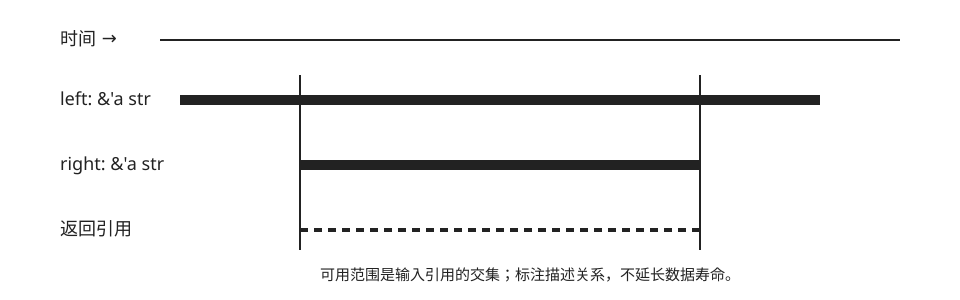

# 生命周期、泛型与闭包

| 任务 | 概念 | 预计时间 | 项目产物 |
|---|---|---:|---|
| 返回借用值且不制造悬垂引用 | lifetime、generic、trait bound、closure | 150 分钟 | 可解释的借用关系 |

生命周期（lifetime）标注描述引用之间的关系，不会延长任何值的存活时间。下面的 `'a` 表示：返回引用不会比两个输入中较短的那个活得更久。



```rust
fn longer<'a>(left: &'a str, right: &'a str) -> &'a str {
    if left.len() >= right.len() { left } else { right }
}

fn main() {
    let owned = String::from("monitor");
    assert_eq!(longer(&owned, "web"), "monitor");
}
```

## 故意返回局部借用

```rust,compile_fail
fn invalid<'a>() -> &'a str {
    let local = String::from("temporary");
    &local
}
```

函数返回后 `local` 已 drop；任何标注都不能把它救活。修复选择只有改变所有权：返回 `String`，或借用由调用者拥有的输入。

## 泛型约束表达所需能力

```rust
fn newest<T, F>(items: &[T], key: F) -> Option<&T>
where
    F: Fn(&T) -> u64,
{
    items.iter().max_by_key(|item| key(item))
}

fn main() {
    let values = [3_u16, 9, 4];
    assert_eq!(newest(&values, |value| u64::from(*value)), Some(&9));
}
```

`T` 让算法不绑定具体数据；`F: Fn(&T) -> u64` 只要求闭包提供排序键。先用具体类型写通，再在出现第二个真实调用者时泛化。

## 错误上下文留在边界

```rust
fn parse_status(raw: &str) -> Result<u16, String> {
    raw.parse::<u16>()
        .map_err(|error| format!("invalid HTTP status {raw:?}: {error}"))
}
```

依次完成 `07_lifetimes`、`08_borrowed_struct`、`09_borrowed_slice`，从函数返回值、借用字段和切片三种形状解释同一规则：引用必须来自仍然存活的所有者。
