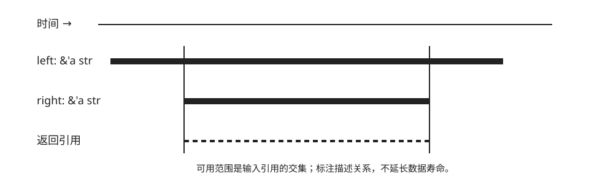

# 生命周期、泛型与闭包

| 任务 | 概念 | 预计时间 | 项目产物 |
|---|---|---:|---|
| 返回借用值且不制造悬垂引用 | lifetime、generic、trait bound、closure | 3 小时 | 可解释的借用关系 |

> **预计 3 小时**。这三件事经常被放在一起讲，其实它们回答三个不同的问题：
>
> - **生命周期**：这个引用能活多久？（编译期的一种约束）
> - **泛型**：这段代码对哪些类型成立？（编译期的一种抽象）
> - **闭包**：一段代码怎么带着它的环境到处走？（运行期的一种值）

三者唯一的共同点是：**都不产生你想当然的那种开销**。这一章要把这句话讲清楚。

---

## 1. 生命周期不是「存活时间」

先纠正一个几乎所有人都有的第一印象。生命周期**不延长也不缩短任何值的存活时间**，它只是告诉编译器：「这几个引用之间存在这样的关系，请按这个关系检查」。

```rust,editable
fn longer<'a>(left: &'a str, right: &'a str) -> &'a str {
    if left.len() >= right.len() { left } else { right }
}

fn main() {
    let owned = String::from("monitor");
    assert_eq!(longer(&owned, "web"), "monitor");
}
```



`'a` 的读法是：**返回值活得不会比两个输入中较短的那个更久**。它没有指定具体多长，只声明了三者之间的关系。运行期没有任何代码为它工作——这是纯编译期的账。

### 三条省略规则

你写的大部分函数根本不需要标注 `'a`，因为编译器会按三条规则补上：

1. 每个引用参数各获得一个独立生命周期；
2. **只有一个**输入生命周期时，输出生命周期等于它；
3. 有 `&self` 或 `&mut self` 时，输出生命周期等于 `self` 的。

```rust,editable
// 规则 2：一个输入，输出跟随它
fn first_word(text: &str) -> &str {
    text.split_whitespace().next().unwrap_or("")
}

// 规则 3：方法返回借用，跟随 &self
struct Report {
    label: String,
}

impl Report {
    fn label(&self) -> &str {
        &self.label
    }
}

fn main() {
    println!("{}", first_word("monitor is up"));
    println!("{}", Report { label: String::from("ok") }.label());
}
```

**只有当你打破这三条规则时，才需要手写 `'a`。** 常见的两种需要标注的情况：有多个输入引用但输出只跟其中一个有关；结构体里存了引用。

### 反例一：返回局部变量的引用

```rust,compile_fail
fn invalid<'a>() -> &'a str {
    let local = String::from("temporary");
    &local
}

fn main() {
    println!("{}", invalid());
}
```

```text
error[E0515]: cannot return reference to local variable `local`
  |
4 |     &local
  |     ^^^^^^ returns a reference to data owned by the current function
```

标注 `'a` 救不了它——这不是标注问题，是**没有所有者**的问题。函数返回时 `local` 就被析构了。

### 反例二：忘了写标注的返回值

```rust,compile_fail
fn longest_name() -> &str {
    let owned = String::from("monitor");
    &owned
}

fn main() {
    println!("{}", longest_name());
}
```

这个版本连编译器的第一关都过不去，而且它的提示非常值得读：

```text
error[E0106]: missing lifetime specifier
  |
1 | fn longest_name() -> &str {
  |                      ^ expected named lifetime parameter
  |
  = help: this function's return type contains a borrowed value, but there is
          no value for it to be borrowed from
help: consider using the 'static lifetime, but this is uncommon unless you are
      returning a borrowed value from a const or a static
  |
1 | fn longest_name() -> &'static str {
  |                       +++++++
help: instead, you are more likely to want to return an owned value
  |
1 - fn longest_name() -> &str {
1 + fn longest_name() -> String {
  |
```

**编译器给了两个互斥的建议，其中第一个是陷阱。** 加 `'static` 只是把「借用了局部变量」改成「声称它永远存在」，那个 `&owned` 依然过不了检查。第二个建议（返回 `String`）才是 99% 情况下的正确答案。这条经验要记住：**编译器的建议保证能推进编译，但不保证符合你的意图**——和 `?` 那章的 `.ok()?` 是同一回事。

### 结构体里存引用

```rust,compile_fail
#[derive(Debug)]
struct Report<'a> {
    label: &'a str,
}

fn fail() -> Report<'static> {
    let owned = String::from("temporary");
    Report { label: &owned }
}

fn main() {
    println!("{:?}", fail());
}
```

```text
error[E0515]: cannot return value referencing local variable `owned`
  |
8 |     Report { label: &owned }
  |     ^^^^^^^^^^^^^^^^------^^
  |     |               |
  |     |               `owned` is borrowed here
  |     returns a value referencing data owned by the current function
```

只要结构体里有一个引用字段，结构体本身就不能活得比被借的值更久。于是 `Report` 需要在类型上带一个 `'a`——**而这个标注会沿着调用链一路传染**：持有 `Report` 的结构体也要标，返回 `Report` 的函数也要标。

### 什么时候该改设计，而不是加标注

当你发现 `'a` 开始往上层蔓延时，先停一下，问一个问题：

> 这个值真的必须借用吗？还是它其实应该拥有一份？

三条常见出路：

| 出路 | 什么时候用 | 代价 |
|---|---|---|
| 返回拥有所有权的值（`String`、`Vec<T>`） | 数据要被存起来、跨线程、放进结构体 | 一次分配 |
| 用 `Cow<'_, str>` | 大多数时候不用改，偶尔需要新建 | 逻辑稍复杂 |
| 让调用方提供缓冲区（`fn fill(&self, out: &mut String)`） | 调用频繁、想复用分配 | 接口不那么直观 |

`'static` 也常被误解。它有两种含义，别混：

- **作为引用类型**，`&'static T` 表示「活得和程序一样久」：字符串字面量、`static` 变量。
- **作为 trait bound**（`T: 'static`），它表示「这个类型内部不借用任何短命的东西」。

一个拥有全部字段的 `String` 满足 `T: 'static`：这不是说它永远不释放，而是说它**不欠任何人的债**。多线程传值（`thread::spawn`）要求 `'static`，用的正是第二个含义——它不是要求数据永生，而是要求数据里没有指向别人栈帧的引用。
---

## 2. 泛型：从具体到抽象

### 单态化：为什么泛型不慢，以及它真正的代价

Rust 的泛型是**编译期展开**的：编译器为每一个实际用到的类型参数生成一份专门的机器码（monomorphization）。所以 `Vec<u16>` 和 `Vec<String>` 的 `push` 是两份不同的代码，各自针对元素大小优化过。

代价不在运行期，而在**编译时间和二进制体积**：用得越广，生成的代码份数越多。`cargo bloat` 之类的工具就是用来查「谁把体积撑大了」的。

### 约束的三种写法

```rust,editable
use std::fmt::Display;

// 写法一：内联约束
fn log_inline<T: Display>(value: T) -> String {
    format!("value = {value}")
}

// 写法二：where 子句（约束多、或签名长时可读性更好）
fn log_where<T>(value: T) -> String
where
    T: Display,
{
    format!("value = {value}")
}

// 写法三：impl Trait 参数（只有一个泛型参数、不需要命名时最简洁）
fn log_impl(value: impl Display) -> String {
    format!("value = {value}")
}

fn main() {
    println!("{}", log_inline(200));
    println!("{}", log_where("ok"));
    println!("{}", log_impl(2.5));
}
```

三者生成完全相同的代码。选择标准是可读性：**需要命名类型参数（要返回 `T`、要在别的约束里引用它）就用前两种；只是「接受任何实现了某 trait 的东西」就用第三种。**

### `impl Trait` 返回与 `dyn Trait`

```rust,editable
fn numbers() -> impl Iterator<Item = u16> {
    [200_u16, 404].into_iter().filter(|status| *status < 300)
}

fn main() {
    let collected: Vec<u16> = numbers().collect();
    println!("{collected:?}");
}
```

这会让人以为 `impl Trait` 就是「动态派发」。不是。返回位置的 `impl Trait` 依然在编译期确定具体类型，只是**对调用方隐藏**。真正的动态派发是 `dyn`：

| | `impl Trait` / 泛型 | `dyn Trait` |
|---|---|---|
| 何时确定具体类型 | 编译期 | 运行期 |
| 是否装箱 | 否 | 需要（`Box<dyn T>`、`&dyn T`） |
| 分派方式 | 静态（可内联） | 虚表（一次间接跳转） |
| 能否放进同一个集合 | 不能（每个类型不同） | 能（`Vec<Box<dyn T>>`） |
| 对象安全约束 | 无 | 有：不能有泛型方法、不能返回 `Self`、不能是 `async fn` |
| 编译时间与体积 | 每个类型一份代码 | 一份代码 |

**选择规则：先用泛型或 `impl Trait`（快、无分配）；当运行期确实需要持有「不同的实现」时才用 `dyn`。** 这也是本项目存储接缝的取舍，完整推导见[对象安全配方](../recipes/object-safety.md)。

### 泛型约束表达所需能力

```rust,editable
fn newest<T, F>(items: &[T], key: F) -> Option<&T>
where
    F: Fn(&T) -> u64,
{
    items.iter().max_by_key(|item| key(item))
}

fn main() {
    let statuses = [200_u16, 503, 404];
    assert_eq!(newest(&statuses, |status| u64::from(*status)), Some(&503));
}
```

`T` 让算法不绑定具体数据；`F: Fn(&T) -> u64` 只要求闭包提供排序键。注意这里的顺序：**先用具体类型写通，等到出现第二个真实调用者时再泛化。** 提前泛化会让你为一个想象中的复用付出理解成本。

---

## 3. 闭包：带着环境的函数

```rust,editable
fn main() {
    let threshold = 300_u16;

    // 闭包捕获了 threshold（只读）
    let is_healthy = |status: u16| status < threshold;

    println!("{}", is_healthy(200));
    println!("{}", is_healthy(500));
}
```

闭包就是匿名函数加**捕获的环境**。类型通常由编译器推断，只在存进结构体、作为返回值、或者有多个可能类型时才需要写出来。

### 三种 `Fn` trait，对应三种捕获方式

| trait | 调用时对 `self` 的要求 | 对应捕获方式 | 能调用几次 |
|---|---|---|---|
| `FnOnce` | 消耗 `self` | 移动（拿走环境里的值） | 一次 |
| `FnMut` | `&mut self` | 可变借用 | 多次 |
| `Fn` | `&self` | 不可变借用 | 多次 |

三者是**包含关系**：每个 `Fn` 都是 `FnMut`，每个 `FnMut` 都是 `FnOnce`。所以写约束时的规则是：

- 只调用一次的接口写 `FnOnce`——它能接受的东西最多；
- 会多次调用、需要修改状态的写 `FnMut`；
- 只是读的写 `Fn`——最严格，但最明确。

一句话记：**参数位置的 `Fn` 系列，能宽就宽；接收方要求的越少，能传进来的闭包越多。**

### 捕获的精度：按字段，不按整个结构体

```rust,editable
struct Config {
    timeout_ms: u64,
    attempts: u32,
}

fn main() {
    let mut config = Config { timeout_ms: 5_000, attempts: 2 };

    // 只捕获 config.timeout_ms，没有借用整个 config
    let describe = || format!("超时 {} 毫秒", config.timeout_ms);

    // 所以另一个字段仍然可以被原地修改
    config.attempts = 3;

    println!("{}", describe());
    println!("attempts = {}", config.attempts);
}
```

这就是 `async` 块只捕获用到的那几个字段背后的同一套机制——它让借用检查在很多场景下不再误报。

### `move` 闭包与 `'static`

```rust,editable
fn main() {
    let name = String::from("monitor");

    // move 把 name 移进闭包
    let describe = move || format!("监控 {name}");
    println!("{}", describe());
    println!("{}", describe());   // 仍然是 Fn：可以多次调用
}
```

`move` 决定**怎么捕获**（拿走，而不是借用），不决定实现哪个 `Fn` trait：上面这个闭包移动了 `name`，但调用时只是读它，所以仍然实现了 `Fn`，可以多次调用。`move` 真正必用的场景是把闭包交给别的线程、或存进结构体——那时闭包必须 `'static`，也就是不借用任何栈上数据。

### 反例：`FnOnce` 被调用了两次

```rust,compile_fail
fn main() {
    let owned = String::from("monitor");

    // 闭包把 owned 返回出去，等于每次调用都要「消耗」环境
    let consume = move || owned;

    println!("{}", consume());
    println!("{}", consume());
}
```

```text
error[E0382]: use of moved value: `consume`
  |
4 |     println!("{}", consume());
  |                    --------- `consume` moved due to this call
5 |     println!("{}", consume());
  |                    ^^^^^^^ value used here after move
  |
note: closure cannot be invoked more than once because it moves the variable
      `owned` out of its environment
  |
3 |     let consume = move || owned;
  |                           ^^^^^
note: this value implements `FnOnce`, which causes it to be moved when called
```

修法取决于意图：如果只是要读，去掉 `move` 或者返回 `owned.clone()`；如果确实要把值交出去一次，那就只调用一次——`FnOnce` 正是「消耗型回调」的正确类型，例如 `Option::map` 和 `thread::spawn` 接受的闭包。

### 闭包作为返回值

```rust,editable
/// 返回一个「判断状态码是否健康」的闭包。
fn healthy_checker(threshold: u16) -> impl Fn(u16) -> bool {
    move |status| status < threshold
}

fn main() {
    let checker = healthy_checker(300);
    println!("{}", checker(204));
    println!("{}", checker(500));
}
```

`impl Fn(u16) -> bool` 是返回闭包的标准写法。要点是 `move`：`threshold` 是函数参数，函数返回后它就不存在了，闭包必须把它带走。这也顺带解释了为什么返回闭包几乎总要 `'static`——闭包捕获的值也必须是 `'static`。
---

## 4. 三者组合起来的真实形状

项目里最常见的组合是「泛型容器 + 闭包提取 + 借用输入」：

```rust,editable
fn summarize<T, F>(items: &[T], describe: F) -> Vec<String>
where
    F: Fn(&T) -> String,
{
    items.iter().map(|item| describe(item)).collect()
}

fn main() {
    let statuses = [200_u16, 404, 503];
    let lines = summarize(&statuses, |status| {
        let verdict = if *status < 300 { "healthy" } else { "problem" };
        format!("{status}: {verdict}")
    });
    println!("{lines:?}");
}
```

拆开看这个签名：`items: &[T]` 借用输入；`T` 让函数对元素类型不敏感；`F: Fn(&T) -> String` 要求一个只读的、可多次调用的闭包；返回值拥有所有权（`Vec<String>`），所以调用方不必关心输入活多久。

**这就是「接口描述意图」的样子**：只看签名就知道它不接管输入、不修改输入、可以调用很多次、输出归你。

---

## 5. 深水区

### 5.1 高阶生命周期约束（HRTB）

偶尔你会看到 `for<'a>` 这种写法：

```rust,ignore
fn apply<'a, F>(text: &'a str, transform: F) -> &'a str
where
    F: for<'b> Fn(&'b str) -> &'b str,
{
    transform(text)
}
```

`for<'b>` 读作「对**任意**生命周期 `'b` 都成立」。它的必要性在于：普通约束里的 `'a` 是某个**具体**的（虽然未知的）生命周期，而 `for<'b>` 表达的是「不管你给什么生命周期都能工作」。绝大多数代码不需要它；需要它的时候，编译器给出的错误信息会相当难读（`implementation of FnOnce is not general enough`），这也是本项目 `check_all` 里选择让每个任务拥有自己数据的原因之一。

### 5.2 变型：为什么 `&mut T` 不能协变

生命周期参数有「变型」（variance）规则，最重要的两条：

- `&'a T` 对 `'a` **协变**：长生命周期可以当短的用（把 `&'static str` 传给需要 `&'a str` 的函数没问题）。
- `&'a mut T` 对 `'a` **不变**：既不能放宽也不能收紧。

第二条的理由值得想一分钟。假设 `&'long mut T` 能当 `&'short mut T` 用，那么：

```text
1. 你有一个 Vec<&'long str>
2. 通过某种手段拿到 &mut Vec<&'short str>（这就是「不变」要禁止的）
3. 往里面塞一个 'short 的引用（合法，因为类型说可以）
4. 回到第 1 步的视角：Vec 里出现了一个早就不存在的引用
```

「可变引用 + 协变」会直接制造悬垂引用，所以类型系统必须禁止它。你不需要记住术语，只需要记住结论：**`&T` 能放宽，`&mut T` 不能。**

### 5.3 `impl` 块上的生命周期

```rust,editable
struct Report<'a> {
    label: &'a str,
}

impl<'a> Report<'a> {
    // 返回 &'a str：借用的寿命与结构体持有的引用一样长
    fn label(&self) -> &'a str {
        self.label
    }

    // 对比：返回 &str（省略后等价于 &self 的寿命）
    fn label_borrowed(&self) -> &str {
        self.label
    }
}

fn main() {
    let owned = String::from("monitor");
    let report = Report { label: &owned };
    println!("{} / {}", report.label(), report.label_borrowed());
}
```

两个方法的区别很实际：`label()` 返回的引用**不绑定在 `report` 上**——你可以把 `report` 丢掉，返回值仍然有效（因为它借的是 `owned`）。`label_borrowed()` 的返回值则不能比 `report` 活得更久。想清楚这个区别，你就能在需要时把 `'a` 显式写出来换取灵活性。

### 5.4 闭包、`'static` 与线程

把闭包交给 `thread::spawn` 时，约束是 `F: FnOnce() + Send + 'static`：

- `FnOnce`：线程只会调用一次；
- `Send`：闭包捕获的东西要能安全地送到另一个线程；
- `'static`：闭包不能借用当前函数的栈。

三条合起来的意思是：**线程的闭包必须「自给自足」**。所以你会看到 `move` 到处出现——它不是装饰，而是满足 `'static` 的手段。这部分在并发章节会展开。

---

## 6. 常见误解

| 误解 | 准确说法 |
|---|---|
| 「生命周期标注会让值活得更久」 | 它只描述引用之间的关系，不改变任何东西的存活时间。 |
| 「每个引用都得写 `'a`」 | 三条省略规则覆盖了大多数函数；只有多个输入且输出有歧义、或结构体存引用时才需要手写。 |
| 「泛型有运行期开销」 | 单态化后没有间接跳转；代价在编译时间和二进制体积。 |
| 「`impl Trait` 就是 `dyn Trait` 的语法糖」 | 一个是编译期隐藏具体类型，一个是运行期查虚表；前者无装箱、不能放进同一集合。 |
| 「`move` 闭包就是 `FnOnce`」 | `move` 决定**怎么捕获**，`Fn`/`FnMut`/`FnOnce` 决定**怎么调用**。移动捕获的闭包通常仍然是 `Fn`。 |
| 「闭包会捕获整个结构体」 | Rust 2021 起按字段捕获，没用到的字段不借。 |

---

## 7. 练习与自测

### 练习

```sh
cd exercises
rustlings run 07_lifetimes
rustlings run 08_borrowed_struct
rustlings run 09_borrowed_slice
```

三个练习对应三种形状：函数返回值、结构体字段、切片参数。做完之后，用同一句话解释它们：**引用必须来自仍然存活的所有者，标注只是在描述这个事实。**

### 自测清单（能全部做到才算掌握）

1. 用一句话说明生命周期标注到底约束了什么，并指出它**不**做什么。
2. 默写三条生命周期省略规则，并各举一个被它们救过（不用写 `'a`）的函数签名。
3. 解释为什么返回 `&local` 时加 `'static` 不能解决问题。
4. 给出 `impl Trait` 与 `dyn Trait` 的三个区别，并说明本项目为什么在存储接缝上放弃了 `dyn`。
5. 说出 `Fn`、`FnMut`、`FnOnce` 的包含关系，并说明函数参数该按什么顺序选择。
6. 解释「`move` 闭包仍然可以是 `Fn`」。
7. 解释为什么 `&mut T` 不能协变，用悬垂引用的场景说明。
8. 写出一个返回闭包的函数，并说明为什么必须写 `move`。

第 7、8 题是这一章的试金石：答得出来，说明你把「生命周期是关系而不是寿命」真正内化了。
