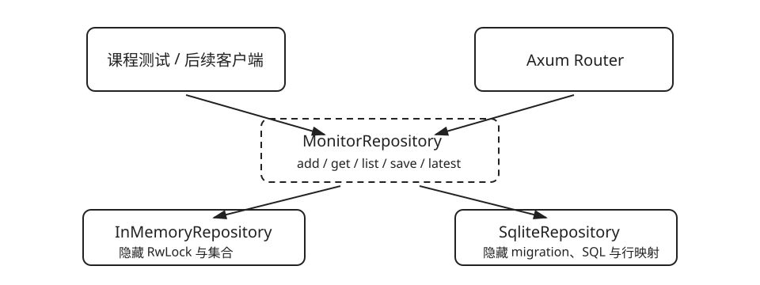

# 用 trait 建立可替换的存储接缝

| 任务 | 概念 | 预计时间 | 项目产物 |
|---|---|---:|---|
| 让内存与 SQLite 共用调用方式 | trait、泛型、trait object、集成测试 | 120 分钟 | `MonitorRepository` 接口和两个适配器 |

trait 在这里不是为了“展示抽象”，而是为了建立真实接缝（seam）：Web 路由只学习一组小接口，存储复杂度留在适配器内部。



```rust,ignore
#[async_trait]
pub trait MonitorRepository: Send + Sync {
    async fn add_target(&self, target: MonitorTarget) -> Result<StoredTarget, StoreError>;
    async fn get_target(&self, id: i64) -> Result<Option<StoredTarget>, StoreError>;
    async fn save_result(&self, id: i64, result: CheckResult) -> Result<(), StoreError>;
}
```

先预测：若删除这个 trait，哪些 `add/get/save` 规则会散落到 Axum handler 和测试中？如果答案是“几乎没有”，这个模块还不够深。

## 两个适配器才是真接缝

- `InMemoryRepository`：反馈快，适合共享状态和 HTTP 行为测试。
- `SqliteRepository`：负责建表、行转换、错误映射与持久化。

测试只调用 `MonitorRepository` 的公开接口，不读取内部 `RwLock`，也不绕过接口直接查询数据库。

```sh
cargo test -p monitor-store --test in_memory
cargo test -p monitor-store --test sqlite
```

完成 `05_repository`，然后尝试在不改调用者的情况下替换适配器。
