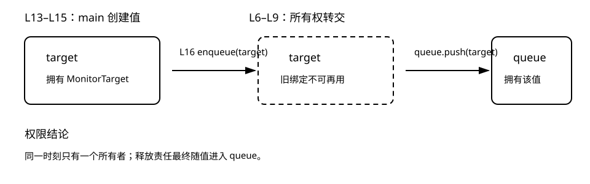
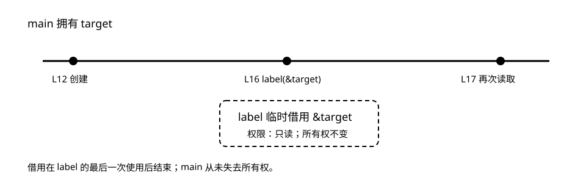
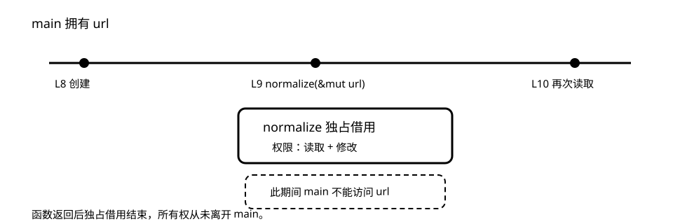

# 所有权：移动、借用与可变借用

本章不要求背规则。你只需要在每一行问两个问题：

1. 当前谁拥有这个值？
2. 当前谁被允许读取或修改它？

## 实验一：move 把责任一起交出去

先预测：`enqueue(target)` 之后，谁负责释放 `String`？点击代码右上角运行，再试着在最后一行读取 `target.url`。

```rust,editable
{{#include ../examples/ownership/move.rs}}
```



传值参数 `target: MonitorTarget` 会接管值。移动不是复制字节的承诺，而是把“谁可以使用、谁负责释放”的权限转交给新位置。

下面的失败是教材的一部分：

```rust,compile_fail
#[derive(Debug)]
struct MonitorTarget { url: String }

fn enqueue(target: MonitorTarget) -> Vec<MonitorTarget> {
    vec![target]
}

fn main() {
    let target = MonitorTarget { url: String::from("https://example.com") };
    let queue = enqueue(target);
    println!("{} {}", target.url, queue.len());
}
```

看到 `E0382` 时，先问：函数真的需要拥有值吗？如果需要，调用后不要再使用旧绑定；如果只需读取，改为借用。不要条件反射地加 `.clone()`。

## 实验二：`&T` 借出只读权限

先预测：调用 `label(&target)` 后，为什么 `target` 还能继续使用？

```rust,editable
{{#include ../examples/ownership/borrow.rs}}
```



`&MonitorTarget` 的接口承诺“我只读取，不接管”。借用在 `label` 的最后一次使用后结束；所有权一直留在 `main`。

这也是网站健康监测器创建 `CheckResult` 时采用的形状：结果读取目标信息，但不拿走监测目标，因为同一个目标还要被重复检查。

## 实验三：`&mut T` 是临时独占写权限

先预测：如果在 `normalize` 调用期间再读取 `url`，为什么会被拒绝？

```rust,editable
{{#include ../examples/ownership/mutable_borrow.rs}}
```



`&mut T` 不转移所有权，但在借用期间给调用者独占的读写权限。独占是关键：同一段时间里不能再有其他读或写访问。

```rust,compile_fail
fn main() {
    let mut url = String::from("example.com");
    let view = &url;
    let writer = &mut url;
    writer.insert_str(0, "https://");
    println!("{view}");
}
```

这段代码触发借用冲突，因为 `view` 的最后一次使用发生在可变借用之后。修复时优先缩短借用范围或调整操作顺序，而不是绕开检查器。

## 三个选择，先看意图

| 参数形状 | 函数获得什么 | 调用后原绑定 |
|---|---|---|
| `T` | 所有权 | 通常不可再用 |
| `&T` | 临时只读权限 | 可继续使用 |
| `&mut T` | 临时独占读写权限 | 借用结束后可继续使用 |

## 现在去修改代码

```sh
cd exercises
rustlings
```

依次完成 `01_move`、`02_borrow`、`03_mut_borrow`。卡住时先读编译器错误；再输入 `h`；最后才打开[分层提示](hints.md)。

想观察更复杂程序的编译期权限和运行期状态，可以把最小案例放进 [Aquascope](https://cel.cs.brown.edu/aquascope/)；本章始终保留静态图作为稳定参照。
