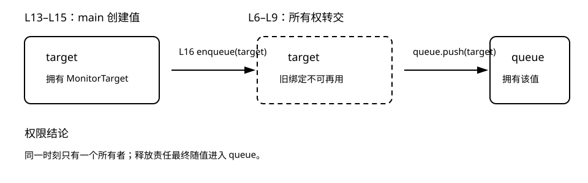
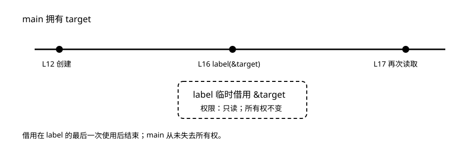
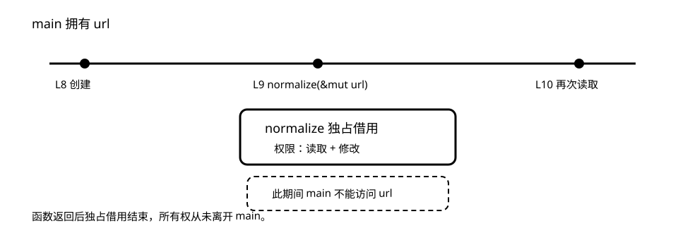

# 所有权：移动、借用与可变借用

> **预计 2–3 小时**（含练习）。只有 60 分钟的话：读 `1–`6，跳过标着「深水区」的小节，做完三个实验直接去练习。

这一章不要求你背规则。整章只反复问三个问题：

1. 这个值现在**归谁所有**？
2. 谁被允许**读**它？
3. 谁被允许**改**它？

Rust 的编译器对这三个问题有精确答案。所谓「和借用检查器搏斗」，绝大多数时候不是编译器太笨，而是写代码的人心里没算这笔账，编译器替他算了——然后不同意。

---

## 1. 先建立心智模型：值住在哪里

### 一个 `String` 由两部分组成

`String` 本身只有三个机器字：指向缓冲区的指针、长度、容量。真正的字符住在堆上。这是理解后面一切的前提：**移动一个 `String` 只移动那三个字，不移动字符。**

```rust,editable
fn main() {
    let url = String::from("https://example.com");
    let view: &str = &url;

    // String 的缓冲区在堆上，&str 指向同一处
    println!("String 缓冲区 = {:p}", url.as_ptr());
    println!("&str   指向   = {:p}", view.as_ptr());
    // 而 String 这个结构体本身在栈上
    println!("String 自身   = {:p}", &url);
    println!("三个字的大小 = {} 字节", std::mem::size_of::<String>());
}
```

先跑一遍，观察前两行地址相同、第三行不同。`&str` 是（指针, 长度）两个字的「借用视图」，它不拥有任何东西。

### 移动到底做了什么

```rust,editable
fn main() {
    let original = String::from("https://example.com");
    let moved = original;              // 移动
    println!("{moved}");
    // println!("{original}");         // 取消注释，看编译器怎么说
}
```

把上面那行的注释去掉，你会拿到 `E0382`。关键问题是：**这次「移动」在机器层面到底发生了什么？**

答案是：一次三个字的复制（指针、长度、容量），然后编译器把源位置标记为「不再有效」。它**不会**往源位置写任何东西，也**不会**在这里调用析构函数——否则堆缓冲区会被释放两次，而新位置仍然指着它。

> 这就是 C++ 里 `std::move` 之后「移后对象处于有效但未指定状态」在 Rust 里的对应物，区别是 Rust 把它变成了编译期错误，而不是一条你需要记住的约定。

---

## 2. 三条规则

所有权只有三条规则：

1. **每个值在任一时刻只有一个所有者。**
2. **所有者离开作用域时，值被释放**（`Drop` 运行）。
3. **所有权可以转移，但转移之后源绑定不再可用。**

这三条推出的结论比看上去多：

| 现象 | 由哪条推出 |
|---|---|
| `let b = a;` 之后 `a` 不能用了 | 规则 1 + 3 |
| 函数按值传参时，调用方失去这个值 | 规则 3（参数是新的绑定） |
| 函数可以返回局部变量 | 规则 3（返回值把所有权带出作用域） |
| 离开作用域自动释放，不需要手动 `free` | 规则 2 |
| 返回 `&local` 编译不过 | 规则 2：被引用的值在函数返回时就没了，引用会悬空 |

最后一条值得亲手试。它是你以后每次写「返回引用」的函数时都要先在脑子里跑一遍的检查。
---

## 3. E0382：移动之后怎么办

先预测：`enqueue(target)` 之后，谁负责释放那个 `String`？点击代码右上角运行，再试着在最后一行读取 `target.url`。

```rust,editable
{{#include ../examples/ownership/move.rs}}
```



传值参数 `target: MonitorTarget` 会接管值。移动不是「复制字节」的承诺，而是**把「谁可以使用、谁负责释放」的权限转交给新位置**。

下面是这次移动的真实报错（不是转述，是编译器原话）：

```rust,compile_fail
#[derive(Debug)]
struct MonitorTarget { url: String }

fn enqueue(target: MonitorTarget) -> Vec<MonitorTarget> {
    vec![target]
}

fn main() {
    let target = MonitorTarget { url: String::from("https://example.com") };
    let queue = enqueue(target);
    println!("{} {}", target.url, queue.len());
}
```

```text
error[E0382]: borrow of moved value: `target`
   |
 9 |     let target = MonitorTarget { url: String::from("https://example.com") };
   |         ------ move occurs because `target` has type `MonitorTarget`,
   |                which does not implement the `Copy` trait
10 |     let queue = enqueue(target);
   |                         ------ value moved here
11 |     println!("{} {}", target.url, queue.len());
   |                       ^^^^^^^^^^ value borrowed here after move
   |
note: consider changing this parameter type in function `enqueue` to borrow
      instead if owning the value isn't necessary
```

注意编译器给了两条 note：一条建议改参数为借用，一条提醒你可以实现 `Clone`。**它们是两个方向完全不同的建议**，选哪个取决于意图：

| 修复方向 | 写法 | 什么时候选 | 代价 |
|---|---|---|---|
| 借 | `fn enqueue(target: &MonitorTarget)` | 函数只读，调用方还要继续用 | 调用方要保证被借的值活得够久 |
| 交 | 调用后不再用旧绑定 | 函数确实要接管这个值 | 无 |
| 克隆 | `enqueue(target.clone())` | 两边都真的需要各有一份 | 一次堆分配 + 一次字节复制 |

第三种是最容易被误用的。`clone()` 能让程序编译通过，但它把你的一次「所有权设计失误」变成了一笔运行期开销，而且它悄悄出现在代码里，评审时也看不出意图。本书的规则是：**`clone()` 应该是一个你能解释的决定，而不是一个让编译器闭嘴的手段。**

---

## 4. 什么时候不是移动：`Copy` 与 `Clone`

有些类型「复制一份」是完全正确的，Rust 允许它们隐式复制：

```rust,editable
fn main() {
    let count: u16 = 200;
    let copy = count;
    println!("count 仍然可用: {count} {copy}");

    let url = String::from("https://example.com");
    let duplicated = url.clone();   // 必须显式：有代价的操作不隐藏
    println!("{url} {duplicated}");
}
```

- `Copy`：`i32`/`u16`/`f64`/`bool`/`char`、共享引用 `&T`、以及全部由 `Copy` 组成的元组与数组。
- 一个类型只有**所有字段都是 `Copy`**、**并且没有实现 `Drop`** 时，才能实现 `Copy`。
- `Copy` 必须先实现 `Clone`；反过来不成立。`String`、`Vec<T>`、`Box<T>` 都是 `Clone` 但不是 `Copy`——它们拥有堆上的资源。

> 一条判断标准：**逐位复制对于这个类型是不是总是正确？** `u16` 是。`String` 不是——两个 `String` 共享同一个缓冲区，析构时就会 double free。

### 部分移动

移动可以只发生在一个字段上：

```rust,compile_fail
#[derive(Debug)]
struct MonitorTarget { name: String, url: String }

fn main() {
    let target = MonitorTarget {
        name: String::from("Rust"),
        url: String::from("https://www.rust-lang.org"),
    };
    let url = target.url;      // 只把 url 字段移走
    println!("moved {url}");   // 合法：url 已经归新绑定
    println!("{target:?}");    // 不合法：target 已经「部分移动」
}
```

```text
error[E0382]: borrow of partially moved value: `target`
   |
 9 |     let url = target.url;
   |               ---------- value partially moved here
11 |     println!("{target:?}");
   |                ^^^^^^ value borrowed here after partial move
   |
   = note: partial move occurs because `target.url` has type `String`,
           which does not implement the `Copy` trait
```

部分移动之后，**剩下的字段仍然可以单独使用**（`target.name` 是好的），但整个 `target` 不能再被当成一个完整的值。这是「结构体的所有权是按字段算的」这条事实的直接后果——记住它，第 7 节会用到。

### 实现了 `Drop` 的类型不能部分移动

```rust,compile_fail
struct MonitorTarget { url: String }

impl Drop for MonitorTarget {
    fn drop(&mut self) {}
}

fn main() {
    let target = MonitorTarget { url: String::from("https://example.com") };
    let url = target.url;
    println!("{url}");
}
```

```text
error[E0509]: cannot move out of type `MonitorTarget`, which implements the `Drop` trait
   |
 9 |     let url = target.url;
   |               ^^^^^^^^^^ cannot move out of here
   |
help: consider borrowing here
   |
 9 |     let url = &target.url;
   |               +
```

原因很直接：`Drop::drop(&mut self)` 会在析构时看到**整个** `self`。如果某个字段已经被移走，`drop` 就会读到一个不存在的值。所以「实现了 `Drop`」和「可以部分移动」是互斥的。
---

## 5. 借用：把权限借出去，所有权留下

先预测：调用 `label(&target)` 后，为什么 `target` 还能继续使用？

```rust,editable
{{#include ../examples/ownership/borrow.rs}}
```



`&MonitorTarget` 的接口承诺「我只读取，不接管」。这正是网站健康监测器创建 `CheckResult` 时采用的形状：结果需要读取目标信息，但不能拿走监测目标，因为同一个目标还要被反复检查。

### 借用在哪里结束：不是作用域，是最后一次使用

```rust,editable
fn main() {
    let mut statuses = vec![200_u16, 404, 503];
    let first = &statuses[0];       // 不可变借用开始
    println!("first = {first}");    // 最后一次使用
    statuses.push(500);             // 可以了：借用已经结束
    println!("{statuses:?}");
}
```

把 `println!` 挪到 `push` 之后，同一个程序就会编译失败。这解释了为什么很多人觉得借用检查器「时灵时不灵」：它算的不是花括号的范围，而是**每个引用的活跃区间**（non-lexical lifetimes，NLL）。判断方法只有一句：**从这个引用被创建，到它最后一次被使用，中间不能有冲突访问。**

---

## 6. 可变借用是独占权限

先预测：如果在 `normalize` 调用期间再读取 `url`，为什么会被拒绝？

```rust,editable
{{#include ../examples/ownership/mutable_borrow.rs}}
```



`&mut T` 不转移所有权，但在借用期间给调用者**独占**的读写权限。独占是关键：同一段时间里不能再有其他读或写访问。

```rust,compile_fail
fn main() {
    let mut url = String::from("example.com");
    let view = &url;
    let writer = &mut url;
    writer.insert_str(0, "https://");
    println!("{view}");
}
```

```text
error[E0502]: cannot borrow `url` as mutable because it is also borrowed as immutable
   |
 3 |     let view = &url;
   |                ---- immutable borrow occurs here
 4 |     let writer = &mut url;
   |                  ^^^^^^^^ mutable borrow occurs here
 6 |     println!("{view}");
   |                ---- immutable borrow later used here
```

最后一行是重点：**冲突不是因为 `&mut` 本身，而是因为 `view` 在那之后还要被使用。** 删掉最后的 `println!`，程序就通过。

### 为什么必须独占：别名 + 变异 = 未定义行为

如果允许同时存在 `&T` 与 `&mut T`，那么「读到一半时别人改掉了」在单线程下只是逻辑错误，在多线程下就是数据竞争。Rust 把这条边界画在了编译期。

对比一下 C++：

| 场景 | C++ | Rust |
|---|---|---|
| 遍历容器时插入元素 | 编译通过，运行时迭代器失效（UB） | `E0502`，编译期拒绝 |
| 两个指针指向同一对象，一个改一个读 | 编译通过，靠人保证 | 编译期拒绝 |
| 悬垂引用 | 编译通过（警告也只能覆盖一部分） | `E0505`，编译期拒绝 |

这解释了 Rust 的「学习曲线陡」：它把其他语言推到运行期和代码评审里的问题，搬到了你写代码的这一刻。

### 两个可变借用也不能重叠

```rust,compile_fail
fn main() {
    let mut url = String::from("example.com");
    let first = &mut url;
    let second = &mut url;
    first.push('!');
    second.push('?');
    println!("{first} {second}");
}
```

```text
error[E0499]: cannot borrow `url` as mutable more than once at a time
   |
 3 |     let first = &mut url;
   |                 -------- first mutable borrow occurs here
 4 |     let second = &mut url;
   |                  ^^^^^^^^ second mutable borrow occurs here
 5 |     first.push('!');
   |     ----- first borrow later used here
```

### 边遍历边修改：最常见的真实报错

```rust,compile_fail
fn main() {
    let mut statuses = vec![200_u16, 404, 500];
    for status in &statuses {
        if *status == 500 {
            statuses.push(503);
        }
    }
    println!("{statuses:?}");
}
```

```text
error[E0502]: cannot borrow `statuses` as mutable because it is also borrowed as immutable
   |
 3 |     for status in &statuses {
   |                   --------- immutable borrow occurs here
 5 |             statuses.push(503);
   |             ^^^^^^^^^^^^^^^^^^ mutable borrow occurs here
   |
   = help: consider using an index-based loop instead, or collecting
           modifications into a separate collection
```

编译器连怎么改都说了。三种常见修法，按推荐顺序：

1. **先收集再修改**：`let added: Vec<_> = ...; statuses.extend(added);`——意图最清楚。
2. **按索引遍历**：`for i in 0..statuses.len()`——但要小心越界与逻辑变复杂。
3. **用能表达这个操作的 API**：`retain`、`iter_mut`——通常是最地道的答案。

---

## 7. 借用拆分：不是所有重叠都是冲突

一个反直觉的事实：**同时可变借用同一个结构体的不同字段是合法的。** 因为所有权是按字段算的。

```rust,editable
struct Pair {
    codes: Vec<u16>,
    reasons: Vec<String>,
}

fn main() {
    let mut pair = Pair {
        codes: vec![200],
        reasons: vec![String::from("OK")],
    };

    let codes = &mut pair.codes;
    let reasons = &mut pair.reasons;
    codes.push(404);
    reasons.push(String::from("Not Found"));

    println!("{codes:?} {reasons:?}");
}
```

但同样的意图，只要换成**通过方法访问整个 `self`**，就会被拒绝：

```rust,compile_fail
struct Pair {
    codes: Vec<u16>,
    reasons: Vec<String>,
}

impl Pair {
    fn clear_codes(&mut self) {
        self.codes.clear();
    }
}

fn main() {
    let mut pair = Pair {
        codes: vec![200],
        reasons: vec![String::from("OK")],
    };

    let codes = &mut pair.codes;
    pair.clear_codes();          // 需要 &mut pair，而 codes 仍在借用中
    println!("{codes:?}");
}
```

```text
error[E0499]: cannot borrow `pair` as mutable more than once at a time
   |
18 |     let codes = &mut pair.codes;
   |                 --------------- first mutable borrow occurs here
19 |     pair.clear_codes();
   |     ^^^^ second mutable borrow occurs here
20 |     println!("{codes:?}");
   |                ----- first borrow later used here
```

这不是编译器的缺陷，而是一个**接口设计信号**：`clear_codes(&mut self)` 声称「我需要整个结构体的独占权」，但它的实现只碰了一个字段。可选的处理方式：

- 传字段而不是 `self`：`fn clear(codes: &mut Vec<u16>)`；
- 让方法接收 `&mut self`，但**不要在持有字段借用时调用它**（调换顺序）；
- 用标准库已经处理好的拆分 API，例如切片：

```rust,editable
fn main() {
    let mut data = vec![1_u32, 2, 3, 4];
    let (left, right) = data.split_at_mut(2);   // 两个不重叠的可变借用
    left[0] = 10;
    right[0] = 30;
    println!("{data:?}");
}
```

> **记一条经验**：当你发现「拆成两个函数就好了」，往往说明原来的函数承担了多份不相关的职责。

---

## 8. 深水区

### 8.1 析构顺序

```rust,editable
struct Noisy(&'static str);

impl Drop for Noisy {
    fn drop(&mut self) {
        println!("drop {}", self.0);
    }
}

fn main() {
    let _first = Noisy("first");
    let _second = Noisy("second");
}
```

输出是 `drop second` 然后 `drop first`：**局部变量按声明的逆序析构**，像栈一样。结构体字段则按**声明顺序**析构。想清楚这一点，你才能解释为什么 `MutexGuard` 一定要在它保护的最后一个变量之前声明，或者干脆用一个块把它圈起来。

### 8.2 从 `&mut` 里把值拿出来

你只有 `&mut T`，却需要一个 `T` 怎么办？不能直接移动出去（`E0507`），除非在原来的位置留一个替身：

```rust,editable
fn main() {
    let mut slot = Some(String::from("https://example.com"));

    // take()：原地留下 None，拿走 Some 里的值
    let taken = slot.take();
    println!("拿走 {taken:?}，原地剩下 {slot:?}");

    let mut url = String::from("https://example.com");
    // replace()：换一个新值进去，旧值归调用方
    let old = std::mem::replace(&mut url, String::from("https://www.rust-lang.org"));
    println!("现在 {url}，旧值 {old} 归我");
}
```

这两个函数是「在 `&mut` 世界里搬走东西」的标准工具。看到有人为了绕开借用检查而到处 `clone` 时，先问一句：这里是不是该用 `take` 或 `replace`？

### 8.3 reborrow：为什么 `&mut` 传进函数后还能再用

```rust,editable
fn bump(values: &mut Vec<u32>) {
    values.push(1);
}

fn main() {
    let mut values = vec![];
    let borrowed = &mut values;
    bump(borrowed);      // 编译器在这里插入一次 reborrow：bump(&mut *borrowed)
    bump(borrowed);      // 所以 borrowed 还能用
    println!("{values:?}");
}
```

但如果你**把它赋给另一个变量**，那就是移动：

```rust,compile_fail
fn bump(values: &mut Vec<u32>) {
    values.push(1);
}

fn main() {
    let mut values = vec![];
    let borrowed = &mut values;
    let moved = borrowed;     // &mut T 不是 Copy：这里是移动
    bump(moved);
    bump(borrowed);
}
```

```text
error[E0382]: borrow of moved value: `borrowed`
   |
 6 |     let moved = borrowed;
   |                 -------- value moved here
 8 |     bump(borrowed);
   |          ^^^^^^^^ value borrowed here after move
   |
   = note: `&mut Vec<u32>` does not implement the `Copy` trait
```

`&mut T` 故意不是 `Copy`：如果它是，独占保证立刻失效——你可以复制出两份可变引用，同时改同一个值。

### 8.4 两阶段借用：`v.push(v.len())`

```rust,editable
fn main() {
    let mut values: Vec<usize> = vec![1];
    values.push(values.len());   // 实参里读了 values，方法又需要 &mut values
    println!("{values:?}");
}
```

按第 6 节的规则，这段代码「应该」被拒绝，但它能编译。原因是编译器使用了两阶段借用：先以共享方式求值实参，求值结束后才真正激活 `&mut`。这是一条实现约定，不是新规则；记住**求值顺序**（先算实参，再激活可变借用）就能预测它的行为。

---

## 9. 常见误解

| 误解 | 准确说法 |
|---|---|
| 「移动就是浅拷贝」 | 机器层面常常是一次字段复制，但**语义**上源绑定失效、不再析构。把 `Copy` 和「移动的实现方式」混为一谈，是后面所有困惑的源头。 |
| 「借用在作用域结束时结束」 | NLL 之后，借用在**最后一次使用**处结束。 |
| 「`clone()` 总是安全的」 | 它总是正确的，但可能把一个设计问题变成每帧一次堆分配。先问要不要借。 |
| 「`&mut T` 就是 C 的指针」 | 它额外携带「无别名」保证，编译器会据此优化。 |
| 「`Rc<RefCell<T>>` 能解决借用检查」 | 它把编译期检查换成了**运行期 panic**。`RefCell` 借冲突会 panic，不是变魔术。 |
| 「编译器太保守」 | 少数情况确实如此（见 `8.4），但绝大多数报错对应真实的接口歧义。 |

---

## 10. 回到项目：这些规则塑造了什么

```rust,ignore
// 只读，不接管：同一个目标要被反复检查
pub fn reachable(target: &MonitorTarget, status: u16) -> CheckResult;

// 借用结果，因为调用方可能还要继续用它
fn save_result(&self, target_id: i64, result: &CheckResult) -> Result<(), StoreError>;

// 需要所有权：名字和 URL 都要被存进结构体，同时接受 String 和 &str
pub fn new(name: impl Into<String>, url: impl Into<String>) -> Result<Self, TargetError>;
```

回到开头那张表——它是本章唯一的「结论」，其余都是它的推导：

| 参数形状 | 函数获得什么 | 调用后原绑定 | 什么时候用它 |
|---|---|---|---|
| `T` | 所有权 | 通常不可再用 | 函数要把值存起来，或者要消耗它 |
| `&T` | 临时只读权限 | 可继续使用 | 只需要读 |
| `&mut T` | 临时独占读写权限 | 借用结束后可继续使用 | 需要原地修改 |

---

## 11. 练习与自测

```sh
cd exercises
rustlings
```

依次完成 `01_move`、`02_borrow`、`03_mut_borrow`。卡住时按这个顺序：先读编译器错误 → 输入 `h` 看提示 → 最后才打开[分层提示](hints.md)。

想观察更复杂程序的编译期权限和运行期状态，可以把最小案例放进 [Aquascope](https://cel.cs.brown.edu/aquascope/)；本章始终保留静态图作为稳定参照。

### 自测清单（能全部做到才算掌握）

不看任何资料，逐条回答：

1. 画出 `String` 在栈和堆上的布局，并解释 `move` 之后哪部分变了、哪部分没变。
2. 说出三条所有权规则，并各自推出一个编译错误。
3. 解释为什么 `&mut T` 不能实现 `Copy`。
4. 给定一段报 `E0502` 的代码，判断删掉哪一行会通过，并说明理由。
5. 说出 `Copy` 与 `Clone` 的两个区别（一个关于隐式性，一个关于 `Drop`）。
6. 解释为什么「实现了 `Drop` 的类型不能部分移动」。
7. 手写一个从 `&mut Option<T>` 中取出值的函数，不许用 `clone`。
8. 解释 `v.push(v.len())` 为什么能编译，而 `v.push(v[0])` 为什么不能。

第 7、8 题没有把握时，回到 `8.2 与 `8.4，然后自己重新写一遍——**只读不写，是这一章最容易骗过自己的地方。**

---

## AI 辅导提示词

这三段可以直接复制给 AI 助手（Kimi、ChatGPT 等）。它们的设计意图是**让助手出题和追问，而不是替你写代码**——完整方法论见[用 AI 助手当教练](ai-tutor.md)。

```text
我在学 Rust 的所有权。请出 5 段短代码（每段 10 行以内），让我判断
「能否编译」，并说明如果编译失败是哪个错误码。
先只出题，不要给答案。我全部答完后，再逐段点评，重点指出我理由里的错误。
```

```text
请审查下面这段代码，只回答一个问题：哪些 clone() 是可以消掉的，
以及各自的替代写法是什么（借用、mem::take、还是调整所有权）。
不要重写整个函数，只指出可以改的那几行。

[粘贴代码]
```

```text
我遇到了 E0502 借用冲突。请不要直接给我修复后的代码，而是：
1. 先用一句话说明编译器认为哪两个借用在时间上重叠了；
2. 然后问我一个问题，帮我自己找到缩短借用范围的办法；
3. 我回答之后再确认或纠正。
如果我的思路会引入新的问题（比如变成运行期 panic），请指出来。

[粘贴完整报错和最小可复现代码]
```
