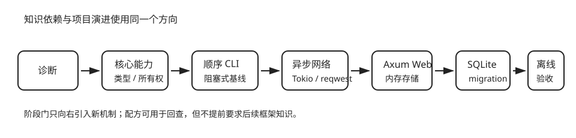

# 30–40 小时标准路径

这条路径为“写过 Rust、但手生了”的读者设计。时间不是阅读配额，而是预测、运行、破坏、修复和解释的实践预算。诊断已经证明熟练的部分可以跳过；每阶段的验收不能跳过。

| 阶段 | 时间 | 必做内容 | 可检查产物 |
|---|---:|---|---|
| 核心能力恢复 | 8–10 小时 | 诊断、所有权三视图、值/集合/模块、`Option`/`Result`、生命周期、trait、练习 01–11 | 领域模型、同步 trait、11 个核心练习通过 |
| CLI 实战 | 8–10 小时 | 参数、JSON、错误边界、顺序基线、批量检查、集成测试、安装 | `monitor` 可安装并通过离线测试 |
| 异步网络与 Web | 14–20 小时 | Future、受控并发、总超时、有限重试、错误分类、Axum、SQLite、追踪、关闭 | CLI 并发检查器与持久化 HTTP API |



## 每个学习单元的交互循环

1. **先预测**：写下能否编译、谁拥有值、会返回哪类结果。
2. **运行**：浏览器示例负责轻量反馈，本地测试负责依赖、网络与数据库。
3. **故意弄坏**：一次只改变一个条件，让编译器或测试暴露心智模型。
4. **最小修复**：先恢复行为，再讨论更深的模块边界。
5. **迁移到项目**：把概念落到网站健康监测器，不另造一次性例子。
6. **用证据结束**：以练习、测试、命令输出或解释题为完成标准。

## 三个阶段门

### 门 1：核心能力

```sh
cd exercises
rustlings
```

完成练习 01–11，并让 `cargo test -p monitor-domain` 通过。你应能解释 move 与 borrow、slice、生命周期关系、`Result<Option<T>, E>`，以及为什么 trait 接缝不应提前泄露数据库或 async。

### 门 2：CLI

```sh
cargo test -p monitor-cli --test sync_command
cargo run -p monitor-cli --bin monitor-sync -- --help
```

完成 CLI 章节的五个实验。此时只使用顺序阻塞客户端，不需要 Tokio；你应能区分参数解析、领域校验、HTTP 检查和输出格式各自的责任。

### 门 3：异步 Web

```sh
cargo test -p monitor-core -p monitor-web
cargo run -p monitor-web
```

完成总超时、重试、并发和两种存储的离线测试，再走一遍本地 API。最后回到[毕业检查点](../web/final-checkpoint.md)回答五个解释题。

## 什么时候查配方

遇到明确错误码或局部任务时，从[配方索引](../recipes/index.md)进入；解决后回到当前阶段门。配方是同一内容的检索入口，不是另一条需要重学的课程。
