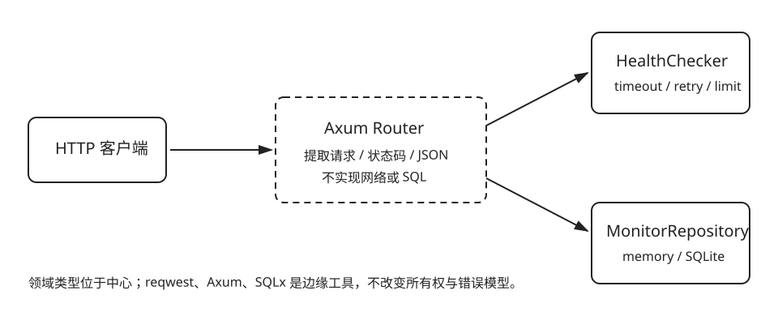

# 用 Axum 暴露 HTTP 接口

| 任务 | 概念 | 预计时间 | 项目产物 |
|---|---|---:|---|
| 把同一领域能力提供给 HTTP 客户端 | Router、extractor、State、JSON、状态码 | 150 分钟 | 可测试的 Axum Router |



路由表：

| 方法 | 路径 | 行为 |
|---|---|---|
| `GET` | `/healthz` | 进程存活检查 |
| `POST` | `/targets` | 验证并保存目标 |
| `GET` | `/targets` | 列出目标 |
| `POST` | `/targets/{id}/checks` | 运行并保存一次检查 |
| `GET` | `/targets/{id}/checks/latest` | 读取最近结果 |

handler 只做 HTTP 与应用数据之间的转换。URL 校验仍由 `MonitorTarget` 负责，网络调度仍由 `HealthChecker` 负责，持久化仍由 `MonitorRepository` 负责。

```sh
cargo test -p monitor-web --test targets_api
cargo test -p monitor-web --test checks_api
```

这些测试直接调用 Router，不绑定固定端口；触发检查时仍使用本地临时 HTTP 服务器。
