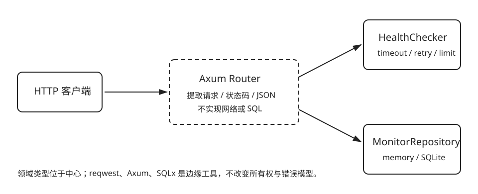

# 用 Axum 暴露 HTTP 接口

| 任务 | 概念 | 预计时间 | 项目产物 |
|---|---|---:|---|
| 把同一领域能力提供给 HTTP 客户端 | Router、extractor、State、JSON、状态码 | 3 小时 | 可测试的 Axum Router |

> **预计 3 小时**。这一章没有新的领域知识——`MonitorTarget`、`HealthChecker`、`MonitorRepository` 都已经写好了。新的东西只有一件：**HTTP 边界**。它的职责是转换，不是判断。



---

## 1. 一次真实的会话

先看结果，再看实现。下面是在本机启动服务后逐条请求的真实输出（服务甚至检查了自己）：

```text
$ curl -i -X POST http://127.0.0.1:3011/targets \
       -H 'content-type: application/json' \
       -d '{"name":"self","url":"http://127.0.0.1:3011/healthz"}'
HTTP/1.1 201 Created
content-type: application/json

{"id":1,"name":"self","url":"http://127.0.0.1:3011/healthz"}

$ curl -X POST http://127.0.0.1:3011/targets/1/checks
{"target_id":1,"name":"self","url":"http://127.0.0.1:3011/healthz",
 "reachable":true,"status":204,"failure":null,"reason":null}

$ curl http://127.0.0.1:3011/targets/1/checks/latest
{"target_id":1,"name":"self","url":"http://127.0.0.1:3011/healthz",
 "reachable":true,"status":204,"failure":null,"reason":null}
```

两个细节值得注意：

1. **刚触发的检查和随后读到的历史完全一致。** 这不是巧合——handler 先保存、再回答（第 4 节）。
2. **服务检查了自己的 `/healthz`**，拿到 `204` 并记为 `Reachable`。用一个不依赖公网的闭环验证整条链路，是很实用的调试手法。

路由表：

| 方法 | 路径 | 行为 | 成功状态码 |
|---|---|---|---|
| `GET` | `/healthz` | 进程存活检查 | `204 No Content` |
| `POST` | `/targets` | 验证并保存目标 | `201 Created` |
| `GET` | `/targets` | 列出目标 | `200 OK` |
| `GET` | `/targets/{id}` | 读取单个目标 | `200 OK` |
| `POST` | `/targets/{id}/checks` | 运行并保存一次检查 | `200 OK` |
| `GET` | `/targets/{id}/checks/latest` | 读取最近结果 | `200 OK` |

---

## 2. Axum 的三个概念

Axum 的模型只有三样东西：

| 概念 | 作用 | 项目里的样子 |
|---|---|---|
| `Router` | 把「方法 + 路径」映射到 handler | `route("/targets", get(list).post(create))` |
| Extractor | 从请求里**取出**类型化的数据 | `Path<i64>`、`State<AppState<R>>`、`Json<CreateTarget>` |
| Response | handler 的返回值决定状态码与响应体 | `(StatusCode::CREATED, Json(view))` |

Extractor 是 Axum 最有特色的地方：**它不是「读参数」，而是「按类型提取」**。参数类型不满足要求时，请求在进入你的代码之前就被拒绝了。

```rust,ignore
async fn create_target<R>(
    State(state): State<AppState<R>>,        // 从共享状态取
    Json(input): Json<CreateTarget>,         // 从请求体取（必须是最后一个参数）
) -> Result<(StatusCode, Json<TargetView>), ApiError>
where
    R: MonitorRepository + 'static,
{
    let target = MonitorTarget::new(input.name, input.url)?;   // 领域校验
    let stored = state.repository.add_target(target).await?;   // 持久化
    Ok((StatusCode::CREATED, Json(TargetView::from(&stored))))
}
```

这个函数只有四行，而且每一行只做一件事：**取数据 → 校验 → 保存 → 回答**。这就是「handler 只做转换」的具体含义。

---

## 3. `State`：共享状态放在哪里

```rust,ignore
pub fn app<R>(repository: Arc<R>, checker: HealthChecker) -> Router
where
    R: MonitorRepository + 'static,
{
    Router::new()
        .route("/healthz", get(healthz))
        .route("/targets", get(list_targets::<R>).post(create_target::<R>))
        .route("/targets/{id}", get(get_target::<R>))
        .route("/targets/{id}/checks", post(run_check::<R>))
        .route("/targets/{id}/checks/latest", get(latest_check::<R>))
        .with_state(AppState { repository, checker })
}
```

三个设计点：

**1. 状态用 `with_state` 注入，不放在全局。** 测试可以传内存仓储，生产传 SQLite——handler 一个字都不用改。

**2. 路由对 `R` 泛型，因为仓储 trait 不是对象安全的。** 所有权章节之后讲过：原生 `async fn` 的 future 不满足 `Send`，所以放弃了 `dyn`。`with_state` 会把 `R` 擦除，调用方拿到的仍是一个具体的 `Router`。完整推导见 `docs/adr/0017`。

**3. `AppState` 的 `Clone` 是手写的**：

```rust,ignore
struct AppState<R> {
    repository: Arc<R>,
    checker: HealthChecker,
}

// 手写而不是 derive：derive 会加上 R: Clone 约束，
// 而仓储并不需要可克隆——共享已经由 Arc 完成了。
impl<R> Clone for AppState<R> {
    fn clone(&self) -> Self {
        Self {
            repository: Arc::clone(&self.repository),
            checker: self.checker.clone(),
        }
    }
}
```

Axum 会为每个请求克隆一次 state，所以 `Clone` 是必需的；但 `#[derive(Clone)]` 会要求 `R: Clone`，这个要求既没必要，也会让不满足的仓储类型无法使用。

---

## 4. handler 的职责边界

「handler 只做 HTTP 与应用数据之间的转换」这句话，展开成一张表：

| 层 | 负责 | **不**负责 |
|---|---|---|
| Router / handler | 路径与方法、状态码、JSON 形状 | 领域校验、网络调度、SQL |
| `MonitorTarget` | 输入不变量（非空名字、http(s) URL） | 发请求、决定状态码 |
| `HealthChecker` | 并发、超时、重试、失败分类 | HTTP 状态码语义（`404` 仍是可达） |
| `MonitorRepository` | 持久化与行映射 | 业务判断 |
| `ApiError` | 把领域错误翻译成状态码 | 产生错误 |

**验证这张表的方法是问：如果明天换成 gRPC，哪一层要改？** 只有 handler 和 `ApiError`。项目里 `monitor-core` 与 `monitor-domain` 被 CLI 和 Web 同时复用，就是这个划分的直接证据。

一个常见的越界写法是「在 handler 里做重试」：

```rust,ignore
// 不要这样：重试策略属于检查器，不属于 HTTP 层
for attempt in 0..3 {
    if let Ok(response) = client.get(url).send().await { ... }
}
```

它看起来只是多写几行，实际后果是：**CLI 和 Web 的重试行为开始分叉**，而且超时预算不再被统一管理。
---

## 5. 错误 → 状态码：一个 `From` 实现

真实的失败响应：

```text
$ curl -X POST .../targets -d '{"name":"bad","url":"ftp://example.com"}'
{"code":"invalid_target","error":"target URL must use http or https"}
STATUS=400

$ curl .../targets/99
{"code":"not_found","error":"target 99 was not found"}
STATUS=404
```

注意响应体里有两个字段：`error` 给人看，`code` 给程序判断。**`code` 的存在是为了让客户端不必解析英文句子**——这和 CLI 章节里「退出码让脚本不必解析 JSON」是同一条原则。

映射只有一处：

```rust,ignore
impl From<TargetError> for ApiError {
    fn from(error: TargetError) -> Self {
        // 用户输入的问题 → 400，而不是 500
        Self::bad_request("invalid_target", error.to_string())
    }
}

impl From<StoreError> for ApiError {
    fn from(error: StoreError) -> Self {
        let message = error.to_string();
        match error {
            StoreError::NotFound { .. }       => Self::not_found(message),   // 404
            StoreError::TargetMismatch { .. } => Self::conflict(message),    // 409
            StoreError::Corrupt { .. }
            | StoreError::Migration { .. }
            | StoreError::Database(_)         => Self::internal(message),    // 500
        }
    }
}
```

因为这两个 `From` 存在，handler 里可以直接写 `?`：

```rust,ignore
let target = MonitorTarget::new(input.name, input.url)?;   // TargetError  -> 400
let stored = state.repository.add_target(target).await?;   // StoreError   -> 404/409/500
```

**错误到状态码的翻译只发生在一个地方。** 这是所有权章节里「`?` 会调用 `From::from`」的直接应用。

| 领域错误 | 状态码 | 谁的问题 |
|---|---|---|
| `TargetError` | `400 Bad Request` | 调用方 |
| `StoreError::NotFound` | `404 Not Found` | 调用方（引用了不存在的 id） |
| `StoreError::TargetMismatch` | `409 Conflict` | 调用方（请求自相矛盾） |
| 其余 `StoreError` | `500 Internal Server Error` | 服务端 |

500 是要记日志的（日志里有 code 和 message，但不回给客户端）：

```rust,ignore
impl IntoResponse for ApiError {
    fn into_response(self) -> Response {
        if self.status.is_server_error() {
            tracing::error!(code = self.code, message = %self.message, "request failed");
        }
        (self.status, Json(serde_json::json!({ "error": self.message, "code": self.code })))
            .into_response()
    }
}
```

### 一个别扭的地方，值得知道

**Extractor 自己产生的拒绝不走 `ApiError`。** 例如请求体不是合法 JSON 时，响应体是 Axum 的格式，不是我们的 `{"code": ...}` 格式：

```text
$ curl -X POST .../targets -d '{ not json'
# 状态码 4xx，但响应体是 axum 的 JsonRejection 格式
```

要么接受这种不一致，要么自己包一层 extractor 把它翻译成 `ApiError`。项目选择先接受，因为**状态码仍然正确**（客户端能据此判断是它自己的问题），而换来的是更少的样板代码。这是一个典型的取舍，不是遗漏——知道取舍在哪里，比假装它不存在更有价值。

---

## 6. 测试 Router：不需要真实端口

```rust,ignore
use tower::ServiceExt;

let response = app(repository, checker)
    .oneshot(
        Request::post("/targets")
            .header("content-type", "application/json")
            .body(Body::from(json!({ "name": "Rust", "url": "https://www.rust-lang.org" }).to_string()))
            .expect("request should build"),
    )
    .await
    .expect("router should respond");

assert_eq!(response.status(), StatusCode::CREATED);
```

`tower::ServiceExt::oneshot` 把 `Router` 当成一个「接收单个请求、返回单个响应」的 service 直接调用。好处：

| 用 `oneshot` | 用真实端口 |
|---|---|
| 不占端口，测试可并行 | 需要挑端口、可能冲突 |
| 不经过网络栈，快 | 每次真实 TCP 往返 |
| 失败立刻定位到 handler | 端口没起来时会看到连接错误，误判 |

代价是**不覆盖网络层**（超时、连接中断、body 分块）。项目用第二种方式补上：触发检查的测试仍然会启动一个本地临时 HTTP 服务器，让 `HealthChecker` 真的发一次请求。

```sh
cargo test -p monitor-web --test targets_api
cargo test -p monitor-web --test checks_api
cargo test -p monitor-web --test error_semantics
cargo test -p monitor-web --test sqlite_api
```

其中 `error_semantics.rs` 专门锁住第 5 节那张状态码表——**它是 API 契约的可执行版本**。

---

## 7. 深水区

### 7.1 Extractor 的顺序有约束

请求体只能被消费一次，所以 `Json<T>` **必须是最后一个参数**。多个 extractor 时，顺序是「从便宜到昂贵」：`Path`、`State`、`Query` 都可以先取，`Json` 放最后。

### 7.2 中间件与可观测性

```rust,ignore
let router = monitor_web::app(repository, checker).layer(
    TraceLayer::new_for_http()
        .make_span_with(DefaultMakeSpan::new().level(Level::INFO))
        .on_response(DefaultOnResponse::new().level(Level::INFO)),
);
```

`tower-http` 的 `TraceLayer` 为每个请求建立一个 span，记录方法、路径、状态码、延迟。这一层**不修改业务逻辑**，只是让「哪个请求慢了、哪个请求 500 了」变得可查。`RUST_LOG=monitor_web=info,tower_http=debug` 可以调详细程度。

### 7.3 优雅关闭

```rust,ignore
axum::serve(listener, router)
    .with_graceful_shutdown(shutdown_signal())     // Ctrl-C 时停止接收新连接
    .await?;
```

回到上一章的定义：**这不是「取消」，是「优雅关闭」**——已经在处理的请求会跑完，只是不再接受新的。生产环境里这个区别很重要：强行中断会让客户端看到连接重置，而不是一个明确的错误响应。

---

## 8. 常见误解

| 误解 | 准确说法 |
|---|---|
| 「handler 里可以做校验和重试」 | 校验属于领域类型，重试属于检查器；handler 只做转换。 |
| 「错误映射写在每个 handler 里更直观」 | 那样同一类错误会在不同路由上映射成不同状态码；`From` 让映射只有一个来源。 |
| 「Web 测试必须启动服务器」 | `oneshot` 直接调 Router；只有需要覆盖网络层时才起临时服务器。 |
| 「非法 JSON 应该返回我们的错误格式」 | Extractor 的拒绝走框架格式；要么接受，要么包一层 extractor。 |
| 「状态码 500 就够了，不用记日志」 | 500 必须能被事后定位；`IntoResponse` 里记 code 与 message 是最省事的做法。 |
| 「`with_state` 只是传参数」 | 它同时擦除类型参数，让泛型 Router 对外表现为一个具体类型。 |

---

## 9. 练习与自测

### 练习

```sh
cargo test -p monitor-web
```

### 最后的破坏性实验（只针对临时数据）

1. 把 `DATABASE_URL` 改为 `sqlite::memory:`，重启后解释数据为什么消失。
2. 在 `targets_api` 中发送非法 URL，先预测状态码和 JSON 错误，再运行测试。
3. 临时让本地测试服务器不回复，确认 API 保存的是 `timeout` 分类，而不是 HTTP 500。
4. 运行服务后按 Ctrl-C，观察优雅关闭是否完成；不要用强制终止作为唯一验证。

实验数据库请使用新建的临时文件，不要指向已有数据。做完后恢复代码并运行全量检查。

### 自测清单（能全部做到才算掌握）

1. 说出 Axum 的三个概念，以及 extractor 为什么「顺序有约束」。
2. 解释 `with_state` 的两个作用，以及 `AppState` 为什么要手写 `Clone`。
3. 用一张表说明 `TargetError`、`StoreError::NotFound`、`TargetMismatch` 与其余存储错误各自对应的状态码。
4. 说明 `code` 与 `error` 两个字段各自服务谁。
5. 解释为什么「刚触发的检查」和「随后读取的历史」必须一致，以及代码里怎么保证。
6. 用 `oneshot` 写一个 Router 测试，并说出它覆盖不到什么。
7. 说明 `TraceLayer` 属于哪一类关注点，以及它为什么不该改业务逻辑。
8. 区分「取消」与「优雅关闭」，并指出项目里各自出现在哪里。

---

## AI 辅导提示词

这三段可以直接复制给 AI 助手（Kimi、ChatGPT 等）。它们的设计意图是**让助手出题和追问，而不是替你写代码**——完整方法论见[用 AI 助手当教练](../guided/ai-tutor.md)。

```text
下面是我的 HTTP 错误映射。请逐条回答：
1. 有没有哪一类错误被我映射成了 500，但其实应该让客户端知道是它的问题？
2. 有没有两类错误共用一个状态码，但客户端的处理方式不同？
3. 响应体是否泄漏了不该给客户端看的内部信息？
只给分析，不要改代码。

[粘贴映射实现与响应体形状]
```

```text
请出 3 道判断题，考察 HTTP 边界的职责划分：
给定几种实现方式（在 handler 里校验、在 handler 里重试、在 repository 里判状态码），
让我判断各自越界在哪一层。我答完后逐条点评。
```

```text
我想给这个服务加一个新端点。请先问我三个问题
（它属于哪一层职责、失败时该返回什么状态码、需要哪种测试覆盖），
然后让我自己写出签名。不要直接给实现。
```
