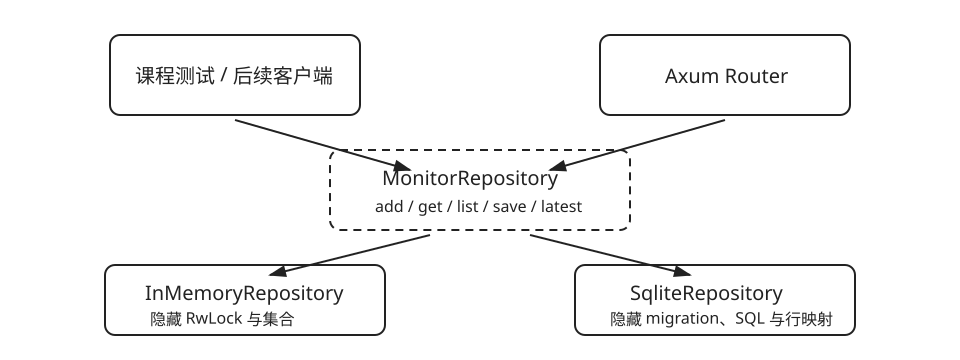

# 从内存切换到 SQLite + SQLx

| 任务 | 概念 | 预计时间 | 项目产物 |
|---|---|---:|---|
| 重启后保留目标与结果 | SQLite、SQLx、行映射、临时数据库 | 150 分钟 | `SqliteRepository` |

阶段顺序很重要：先用 `InMemoryRepository` 学共享状态和接口，再让 `SqliteRepository` 接管 SQL、migration、行转换与数据库错误。Axum 路由不需要改变。



此时已经学过 Future 与 `Send`/`Sync`，才把核心阶段的同步 trait 升级为异步存储边界：

```rust,ignore
// 实现方照旧写 async fn；trait 里声明成 impl Future + Send，
// 于是既不装箱，axum 的 handler 又能满足 Send。
pub trait MonitorRepository: Send + Sync {
    fn add_target(&self, target: MonitorTarget)
        -> impl Future<Output = Result<StoredTarget, StoreError>> + Send;
    fn latest_result(&self, id: i64)
        -> impl Future<Output = Result<Option<CheckResult>, StoreError>> + Send;
    fn save_result(&self, id: i64, result: &CheckResult)
        -> impl Future<Output = Result<(), StoreError>> + Send;
}
```

异步 trait 方法有三种写法，选哪种不是风格问题：`async fn` 直接写在 trait 里，它的 future 不被认为满足 `Send`，axum 的 handler 编译不过；`#[async_trait]` 可用，但每次调用都把 future 装箱；上面的写法把两者都避开，代价是这个 trait 不再能用于 `dyn`——所以 `app` 改成对 `R: MonitorRepository` 泛型，`with_state` 再把 `R` 擦除。决策记录见 `docs/adr/0017`。

`save_result` 借用结果并验证它属于同一个 target；内存和 SQLite 运行同一组契约测试，避免“可替换”只停留在类型层面。

## 错误也要有类型

`StoreError` 曾经是一个装着 `String` 的结构体，于是“目标不存在”和“数据库坏了”在 HTTP 层都变成 `500`。现在它是枚举，Web 层匹配变体决定状态码：

| 变体 | 含义 | HTTP |
|---|---|---|
| `NotFound { target_id }` | 没有这个目标 | 404 |
| `TargetMismatch { target_id }` | 结果不属于这个目标 | 409 |
| `Corrupt { detail }` | 存进去的行读不回来 | 500 |
| `Migration { detail }` | 建表或升级失败 | 500 |
| `Database(sqlx::Error)` | 数据库本身报错 | 500 |

`Database` 通过 `Error::source` 保留底层原因，所以 `eprintln!("{error}")` 仍然能看到 SQLite 的原始报错。

## 连接池的两种形状

`SqliteRepository::connect` 会自动选连接池大小，调用方不需要记住这条规则：

- `sqlite::memory:` 的数据库活在单个连接里。SQLite 的每个纯内存连接都是一个**独立**数据库，所以池子开到两个，就会出现“刚建的表突然不存在”的错觉——内存库固定一个连接。
- 文件数据库使用连接池并开启 WAL（write-ahead logging），让读和写可以同时进行。

```rust,ignore
let repository = SqliteRepository::connect("sqlite://monitor.db").await?;
let router = app(Arc::new(repository), checker);
```

```sh
cargo test -p monitor-store --test sqlite
cargo test -p monitor-store --test contract
cargo test -p monitor-store --test file_database
cargo test -p monitor-web --test sqlite_api
```

自动测试不依赖本机已经安装 SQLite 命令行工具，也不共享开发数据库：内存库用于快速契约测试，文件库测试用临时文件并在析构时连同 `-wal`、`-shm` 一起删除。

建表语句位于 `projects/monitor-store/migrations`，由 SQLx migrator 记录已应用版本。把 schema 从 Rust 字符串中拿出来后，数据库演进有了可审查的顺序，也不会在每个适配器方法里偷偷建表。
